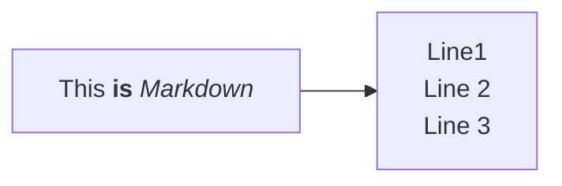

# 10/11/24
## PCB Designing
- Fixed the issue of +3V3 label. One connection was wrong in the schematic and this voltage source was connected to ground. Fixed it,had to update the PCB, so that changes reflect onto the PCB. Just saving the files won't help.
- Done placing all the components onto the PCB.
## OnShape
- Designing a Robot Gripper. 
# 9/11/24
## Questions
- How does the government regulate AI companies?
## Non-technical book: Be so good they can't ignore you
- Focus on difficult activities, carefully choose to stretch your abilities where they need stretching and that provide immediate feedback.
- For example: If you are a guitarist and play the same songs again and again, you'll only stay intermediate. On the other hand, if you play a new song of the same genre, you will improve at least by a little because you are familiar with the style and also there is something new to learn. There is a high chance of improving your skills.
# 8/11/24
## Non-technical book: Be so good they can't ignore you
- What makes an expert different from the intermediate? How to become an expert?
- Stretch your ability.
- Get timely feedback.
- There is a 10 year rule or 10000 hours rule. Just this isn't enough. What you do in those hours matter.
- Get into serious study. Why? Because feedback is immediate. Whereas in a tournament, your opponent might be much better than you or even worse making the possiblity of improving your skill zero.
- Deliberate practice is the key to becoming so good that they can't ignore you.
- If you just show up and work hard, you'll soon hit a performance plateau beyond which you fail to get any better.
- There must be a thirst to even get slightly better.  
## Programming in C++
- Basic programs in cpp
- The playground was very helpful
- Don't use namespace std
- Difference between '\n' and 'endl' and why you should use "\n" instead
- Set up a playground for programming in C++. Just like I did for C, added a custom command such that when I write into a file, it automatically prints the output for the respective program. 
# 7/11/24
## Non-technical book: Be so good they can't ignore you
- Well if you want great work, then you must adopt craftsmanship approach which states that you must offer something of great value in return.
- Traits that define great work: creativity, impact and control.
- Focus on developing your skills in such a way that you become too valuable to be ignored.
- When should you not use the Craftsman mindset? When the job focuses on things that are useless, it forces you work with people you dislike, provides very few opportunities that help you improve your skills that are rare and valuable.
# 6/11/24
## Non-technical book: Be so good they can't ignore you
- "Follow your passion and happiness follows" is a terrible advice.
- Why? Because it is flawed. We tend to assume so much in advance that we don't actually see reality.
- Instead let passion follow you. It takes a lot of time though. Build skills that you don't want to first, give value to the world and only then we get better.
- Job is for paying bills, carrier is there to improvise everyday.
- Most people end up liking their work is because they have spent enough time in it and their work becomes a play and they know their colleagues very well and so their relationships with them is great.
- The young generation has high expectations for work. Job satisfaction rate is steadily decreasing.
## College Stuff
- RF Circuits: Basic differential equations and and its solutions.
- DSP: Circulare Shifting in DFT.
- VLSI: Punch through and Carrier Mobility Degradation.
# 5/11/24
## College Stuff
- VLSI: Leakage current analysis.
- RF Circuits: Transmission lines.
- DSP: Circular convolution.
# 4/11/24
## OnShape 
### [Laser joint](https://youtu.be/YfDmlx2LpFo)
- Included Custom joints feature like laser and dovetail.
- Auto layout feature added.
- Introduction to thicken command.
- Suppose you want to export it for laser cutting, you will have to layout it corectly right. So the custom feature lays down all the parts flat and also asking details like spacing between them, sheet thickness, sheet length and width (total) so that arrangement is as tight as possible.
- Add a drawing sheet and then export it to dxf file format or whatever format your cutter uses.
## College Stuff
- Communication Lab Experiment: Frequency Shift Keying(FSK).
- VLSI: Introduction to fourth terminal: bulk or substrate. Current equation for linear and saturation region.
- Communication: Source Encoding, Channel Encoding and modulation. Talk related to satellite communication. 
# 3/11/24
## Time and Space Complexity: [Reference](https://blog.algomaster.io/p/57bd4963-462f-4294-a972-4012691fc729)
- Learnt about Time and Space Complexity basics.
- Big-O-Notation, Omega notation, Theta notation.
- Big-O: Worst case scenario, Omega: Best case, Theta: Avg.
- n!, 2^n, n^2, nlogn, n, logn, 1.
## PCB Designing
- Placed all the components required for connection.
- Made some connections around ESP32 Board.
- It's always good to refer back to datasheet for recommended values of resistors, capacitors etc. Schematics tend to use different values.
- NC: No Connection.
- Instead of searching for a part online, use the same manufacturer, copy paste its no. in the library search box and changes values, you will get different value components.
## OnShape
- Tag Profile Option.
- Move Document option for a part studio.
- Once the tab is moved, Frame 1 now references the Castle profile as a Linked Document. Taking advantage of Linked Documents to have greater control over the Share permissions and updating.
- Done with frames course. Need to use it on daily basis now.
# 2/11/24
## PCB Designing
- Just went through some datasheets of ESP32 and ESP32S series.
- Learnt how to analyze schematics and place components accordingly.
- Only place components if they are in stock.
- Read application circuits in datasheets for better understanding.
- Neovim perfect setup for C. Can run program within neovim itself and display output on another buffer. You make changes to the program and enter `:w`, output will change automatically.
## OnShape
- While inserting  frames in to assemblies, make sure you insert composite parts and not individual parts. Else, each part will be listed uniquely on the BOM.
- You can insert drawings into sheet similar to inserting composite part in assemblies. Just select composite option.
- You can insert cutlists too, if there are many, then select the one which you want.
- You can insert individual parts too and insert different views to that.
- If there are configurations, then you can choose that too. Values will change automatically. You just need to right click and select configurations option.
- You can add callouts to the drawings and display cut list properties too. This is possible even in BOM table too.
- Changes in part studio will be refected to drawings sheet if we click on update button.
- Creating custom profiles: Just Started
## Pointers In C
- Sorting linked list program by two ways: one just exchange data dand the other, by rearranging pointers.
- Binary tree implementation. Basic terminology.
# 1/11/24
## Buffer Overflow and GDB Analysis
- Reference: [YT](https://www.youtube.com/watch?v=V9lMxx3iFWU&t=431s)
- Wrote a program that inputs a string and depending on the input, the user is granted access if the password is correct.
- `gcc -fno-stack
- Write another text file containing only a single letter, but many.
- Feed the text file while executing (even in GDB). `run < attack.txt`.
- This will result in an error in both terminal and GDB.
- `info func` to list out all the particular functions that exist in this particular binary.
- PLT: Procedure linkage table.
- `disas main`: disassemble main() will display function and their addresses.
- `b *<address>` will place a breakpoint at that address. `*` is important here.
- `lea`: Load effective address instruction.
- Place breakpoints before and after the scanf statement.
- `esp` is a stack pointer. We will list out addresses contained in the esp register by using `x/20x $esp`
- For some reason, my computer says it can't access memory at address.
- [Q/A regarding esp](https://stackoverflow.com/questions/7848771/how-can-one-see-content-of-stack-with-gdb)
- For me, this worked: x/100x $sp. It displays stack memory.
- `^Z` runs gdb in background.
## OnShape
- Composite parts.
- Cut list feature introduction. Column override option.
- Exporting a cut list to another application.
- You can make several cutlists for the same part studio.
- Completed an exercise which made me create multiple cut lists for a reason.
- Delete part options: delete composite parts, dissolve composite parts or ignore composite parts. If you want to remove a composite part which you created, use the dissolve option. Don't just go to part list and delete, it will delete the entire list parts present in the composite part.
## Pointers in C
- Application of linked list: Addition of two Polynomials.
- Merging two linked list program.
# 31/10/24
## OnShape
- Configuration based designing.
- Creating multiple configuration inputs and adding appropriate config features in them.
- Suppressing required parts in a certain configuration.
- You can select a frame itself for configuration. This allows us to suppress or unsupress the frames.
- Introduction to end caps. Different types, offsets, thickness
- Interference Detection is a very powerful tool which can help make sure there is no interference between frames. You can use frame trim or move face features to avoid it.
- Gussets are commonly used for reinforcement in welded frame structures to provide stiffness and strength.
- Types of gussets: triangular and rectangular, offsets etc.
## GDB Tutorial
- `-g` is must for debugging.
- `gui -tui <executable>` to run the gdb. 
- Basic commands like step, next and continue and the difference between them.
- Useful commands like info locals and info args.
- Extremely useful command like watch (a variable). Everytime the variable under watch changes, a message is displayed.
- Task: Look out for a good GDB Cheatsheet!
- `list` command doesn't work in `tui` mode. But in normal it does. `list` prints next 10 lines of code. `list 10,13` lists code from line no 10 to line 13.
- `info source` displays details of current source file.
- If you are working on multiple files, then its good to mention file name while adding breakpoint: `b factorial.c:14`
- Initialise variables using `p a=1` and so on.
- You don't have to exit gdb to run makefiles. Run it inside the gdb itself. 
# 30/10/24
## College Stuff
> Intellectual Properties: Patents, copyrights etc. Apply for patent, who can apply, what conditions should be met, international or terrotorial?
> VLSI: Operating regions: Cutoff, linear and saturation.
> RF Circuits: Various frequency bands. Introduction to mm Waves and microwaves. Advantages of Microwaves etc. Applications of microwaves.
## OnShape
- Use Shift-Enter to create several of the same features in a row. Same feature but a new one will automatically be created.
- Introduction to Split Feature. Splitting the skeleton creates additional paths for frame members and reduces the amount of sketches required.
- Hide other parts in the part studio.
- Frame trim: ordered groups and their priority.
- Visualising step by step the procedure I followed to get to the final frame structure.
- Configuration Panel.
# 29/10/24
## OnShape
- Corner Override Feature and reversing direction.
- Manipulator to adjust the profile.
- Move Face Feature can be used to lengthen or shorten frames.
- Mirroring Entities using mate connectors.
- The whole point of mirroring about mate connectors is that we can avoid making new planes and stuff.
- OnShape groups identical parts in the cut list.
- Ordered groups in face trim option is handy when you want to trim many parts at once. There is a priority in the list selected. The parts at the top are not trimmed but the ones below will be trimmed to the faces of the parts mentioned above in the list.
- You can reorder anytime.
- You can hide parts to make sure whether parts are trimmed correctly or you can use interference detection for the same.
## Pointers in C
> Chapter-4: Pointers and Structures: Sample Questions </br>
## College Stuff
> RF Circuits: Introductory Class: Why RF? </br>
> DTSP: Linear Convolution and Circular Convolution, Poles and Zeroes, Stability of system, Deconvolution, MATLAB Code for linear and circular convolution, What is DFT and how is it different from DTFT and DFS?</br>
> VLSI: Introduction to MOSFETS. Understanding of channels and how current flows.</br>
# 28/10/24
## Project Based Learning in C: Building an Interpreter
- We can store constants in chunk, but it may need some kind of execution like: `print 1;`. So we write a new instruction that loads the constant for use.
- When a runtime error occurs, we need to show the user the line number of the code which is causing trouble.
- So we create a new array. Each number in the array is the line number for corresponding byte in the bytecode.
- When a runtime error occurs, we look up the line number at the same index as the current instruction’s offset in the code array. 
## OnShape
- Frames Designing Course: For every profile, we should create a new frame. Limit frame options to precisely make a frame's length to exactly what we want. Not only that, it takes the shape of that part to which it is limited to. There are different types of frames, we can create a custom one.
- Sketching on a mate connector.
- There is a Standard Library developed by OnShape.
## Atomic Habits
- The more sacred the belief, the more deeply it is tied to our identity and more strongly we will defend it against criticism.
- Keep your identity small. The more you let a single belief define you, the less capable you are of adapting when life challenges you.
- If you have spent every waking moment working on your business, how will you feel after you sell the company?
- "I'm an athlete" -> " I am the type of person who is mentally tough and loves a physical challenge."
- "I'm the CEO" -> "I'm the type of person who builds and creates things."
- College Stuff: Time Division Multiplexing (TDM) experiment as a part of Communication Engineering-2 Syllabus. VLSI: Basics of Mosfets. CE-2: Different Modulation techniques: QPSK, 8-PSK, QAM etc.
# 27/10/24
- Little bit of debugging on GDB.
- Revision of Data Structures in C.
## Atomic Habits
- As habits become more and more automatic, you become less sensitive to feedback. You fall into mindless repetition. You let mistakes slide by.
- Once a skill has been mastered there is usually a slight decline in performance over time.
- Habits + Deliberate Practice = Mastery
- After a habit has been mastered, you have to return to the effortful part of the work and begin building the next habit.
- Be conscious of your performance over time, so that you improve.
- Reflection and Review is important for long-term improvement.
# 26/10/24
## Atomic Habits
- The human brain loves a challenge, but only if it is within an optimal zone of difficulty.
- Goldilocks Rule: Humans experience peak motivation when working on tasks that are right on the edge of their current abilities. Not too hard. Not too easy. Just right.
- An elite coach who has trained many athletes once said: "At some point it comes down to who can handle the boredom of training every day, doing the same lifts over and over and over."
- The greatest threat to success is not failure but boredom.  We get bored with habits because they stop delighting us. The outcome becomes expected. As our habits become ordinary, we start derailing our progress to seek novelty. That is why we get caught up in a never-ending cycle, jumping from one workout to next.
- "Men desire novelty to such an extent that those who are doing well wish for a change as much as those who are doing badly."
- Variable rewards are a powerful way to amplify the cravings we already experience because they reduce boredom. Ex: Slot machines.
- Professionals stick to the schedule. Ameteurs let life get in the way. 
# 25/10/24
## Atomic Habits
- Genes do not determine your destiny. They determine your areas of opportunity.
>> FINDING A GAME WHERE ODDS ARE IN YOUR FAVOR:
>> Easy way is to use the explore/exploit trade-off.
>> Ask yourself these questions:
>> What feels like fun to me, but work to others? It's not whether you love the work, it is whether you can handle the pain of the task easier than most people. When are you enjoying yourself while other people are complaining?
>> What make me lose track of time? Flow is the mental state you enter when you are so focused on the task at hand that the rest of the world fades away.
>> Where do I get greater returns than the average person? We are continually comparing ourselves to those around us, and a behavior is more likely to be satisfying when the comparision is in our favor.
>> What comes naturally to me? Ignore what society has told you. Ignore what others expect of you. When have you felt alive. No more people pleasing. Whenever you feel authentic and genuine, you are headed in the right direction.
- When you can't win by being better, you can win by being different. By combining your skills, you reduce the level of competition, which makes it easier to stand you.
- Our genes do not eliminate the need for hard work. They clarify it. They tell us what to work hard on.
- The secret to maximizing your odds of success is to choose the right field of competition.
- Pick the right habit progress it easy. Pick the wrong habit and life is a struggle.
- Play a game that favors your strengths. If you can't find a game that favors you, create one.
## OnShape
- Design of a box using parametric modelling.
- Sheet Metal Feature: Wrapping of objects using sheet metal. What faces to exclude? What edges to bend? What material to use? What is K factor in bending? What is relief? Closed corner relief type is good.
- Tried Flange feature, hem feature
- Whenever we the sheet metal feature, an icon appears on the right. After clicking on it, you'll see flat view of your part. Edges which are meant to be bent are bent. 
- Generation of elementary and single tone and composite signals using MATLAB. Elementary: Unit impulse, Unit step, Ramp signal, Exponential. Composite: Ramp Signal + Step signal.
# 24/10/2024
## OnShape
- Reference: [YT](https://www.youtube.com/watch?v=NM0YtGTQnDE)
- Introduction to variables.
- Automatic updation of varibles which are linked to each other.
- In value section, while writing the formula, when using `+` or `-`, make sure you use `in` at last or else there will an error.
- Configuration panel: List: Configure Features select the variables which you want, add their values.
- Make another config: All its variables will have same exact values.
- Notice that you have configurations tab on the left now which is default now. Change it to the new configuration you have.
- You can still change the variables' value. The point of configurations is like adding a new version. You can go with any.
- There are many different cams available, try making them?
## Pointers in C 
- Chapter-2 : Arrays and Pointers Revisit
## Atomic Habits
- More costly the mistakes we make, the more faster we will learn from it.
- More immediate the pain, the less likely the behavior. If you want to prevent bad habits, then adding extra cost to the action is a great way to reduce their odds.
- To be productive, the cost of procrastination must be greater than the cost of action. To be healthy, the cost of laziness must be greater than the cost of exercise.
- Knowing that someone is watching can be a powerful motivator. If you don't follow through, perhaps they'll see you as untrustworthy or lazy.
- A habit contract can be used to add a social cost to any behavior. I makes the cost of violating your promises public and painful.
# 23/10/2024
## OnShape
- Design of a simple first class lever. Importance of parallel mates to ensure gravity, load and effort all are parallel. Putting proper constraints of angle of rotation for beam. The beam shouldn't collide with the ground so if we use a equilateral triangle as a fulcrum, the angles won't be 60 degrees, it would rather be more like 30s or even 20s.
- Design of a simple pin slot mate: Rotary to linear motion. I used many parts, actually that wasn't necessary. Selecting the mates for pin slot was tricky, moreover, the constraints should be put correctly.
## Mechanical Movements / Principles
- [YT Video: 1](https://www.youtube.com/watch?v=M1-YeqGynlw&t=338s). [Pictures](https://brickexperimentchannel.wordpress.com/2022/11/14/20-mechanical-principles-machine/)
- Schmidt Coupling, Universal joint (Steering Wheel), CV joint, Slider-Crank Linkage (Reciprocative Motion), Sun and Planet Gear, Scotch Yoke, Chebyshev Lambda Linkage, Chain Drive, Belt Drive, Constant Mesh Gear Box, Oscillating Direction Changer, Torque Limiter, Winch, Rack and Pinion, Offset Gears, Uni-Directional Drive, Camshaft, Intermittent Mechanism, Worm Gear.
## Atomic Habits
- Visual measures are best. The best way to measure your progress is with a habit tracker.
- You improve what you measure. "Don't break the chain" is a powerful mantra.
- Habit tracking is obvious: When evidence is right in front of you, you're less likely to lie to yourself.
- Habit trakcing is attractive: Provides visual proof of your hard work, so it motivates you. And that empty square you see each morning can motivate you to get started because you don't want to lose the progress.
- Habit tracking is satisfying: You're focused on the progress rather than the result. Feels satisfying whenever you record another successful instance of your habit.
- Habit stacking + Habit Tracking formula: After [Current habit] , I will [Track my habit].
- Never miss twice. Or else it will be a start of a new habit.
- First mistake is never the one that ruins you.
- It is really valueable to show up on bad days. Don't put up a zero. Don't let losses eat into your compounding.
- We optimize for what we measure. When a measure becomes a target, it ceases to be a good measure. Measurement is only a useful guide.
- Just because you can measure something doesn't mean it is the most important thing. Just because you can't measure something doesn't mean it's not important at all.
- If you aren't motivated by the number on the scale, perhaps it's time to focus on different measurement-one that gives you more signals of progress.
## Neovim
- Fixed the file explorer issue.
- Setting up buffer is left.
- Created the playground for 'C' language.
- Set up Proper window management.
- Reference: [YT](https://www.youtube.com/watch?v=KYDG3AHgYEs&t=58s)
# 22/10/2024
## Pointers in C
- Intermediate Programs in strings.
## OnShape
- Worm Gear Assembly.
- You can use shift+ to select the centre of a face that is involved in a mate.
- Replicate option in Assembly: Select all that you want to replicate, it gets replicated as a group, so mates still stay as it is. You don't have to do it again. Then select match individual faces and then select a face where you want to replicate it.
- Editing features in Replicate is not allowed. Why?
- Note that we use the same gear relation and we use the same two revolute mate to define the ratio. The ratio might still be incorrect, so we just need to reciprocal it if needed.
## Atomic Habits
- Commitment Devices are useful tools which make bad habits harder.
- The key is to change the task such that it requires more work to get out of the good habit than to get started on it. If you're motivated to get in shape, pay for gym ahead of time. We are increasing the odds that you'll do the right thing in the future by making bad habits hard in the present.
- Best way to break a bad habit is to make it impractical to do.
- You can do one-time actions that lock in good habits. Nutrition: smaller plates to reduce caloric intake. Sleep: Get black curtains, good mattress, remove TV form bedroom.
- Productivity: Unsubscribe from emails, turn off notifications, aeroplane mode, delete games and media apps, website blockers.
- Finance: Enroll in automatic savings plan, cut cable service, ask servive providers to lower your bills, set up automatic bill pay.  
- When working in your favor, automation can make your good habits inevitable and bad habits impossible. So using tech is most reliable.
- If an experience is satisfying, we are more likely to repeat it.
- We have evolved from immediate-return environment to delayed-return environment.
- The costs of your good habits are in the present. The costs of your bad habits are in the future.
- What is immediately punished is avoided and what is immediatley rewarded is repeated. The road less traveled is the road of delayed gratification.
- The last mile is always the least crowded.
- The best way to do this is to add a little bit of immediate pleasure to the habits that pay off in the long run and a little bit of immediate pain to the ones that don't.
- Reward for a good habit is the habit itself. In the beginning, you need a reason to stay on tracck. This is why immediate rewards are essential.
- Whenever you pass on a purchase, put the same amount of money in the account. The immediate reward of seeing yourself save money toward the leather jacket feels a lot better than being deprived. You are making it satisfying to do nothing.
- It is important to select short-term rewards that reinforce your identity rather than ones that conflict with it.
- The first three laws increase the odds that a behavior will be performed this time. The fourth law increases the odds that a behavior will be repeated next time.
# 21/10/2024
## OnShape
- Setting the right limits for the Rack and Pinion Gear System. The axle shouldn't move beyond the pinion length.
- Transforming and Rotating Parts in Part Studio: Draw a construction line, rotate the part around that line by using transform option.
- Transorming and Rotating in Assembly: Well unfix the fixed part, rotate it by some angle which you want, fix it again. Other mates will automatically adjust. Select the part, using the arrows or pointers rotate that part.
- What are STEP files?
- Importing step files in OnShape and importing in a single part studio. Put, all of them in one folder.
- These pulleys aren't necessarily gears but they do have a gear relation. This only works if there is no slipping between pulleys and belt. Otherwise, if were frictionless, it doesn't make sense to make a gear relation. We are assuming that there is enough friction between pulley and belt which is necessary in practical cases.
## Revisiting vim commands
- d$, d0, de, dw and db for delete operation.
- `u` for undo.
- `U` fixes the entire line.
- Ctrl+R undo the undo's.
- `ce` change operation. Although ce and dw looks the same, its not. ce adds a space in between and puts you in insert mode but dw doesn't. `cc` changes the entire line.
- `c number [motion]` is the syntax.
- p is for `put` not, paste, but ya, same thing.
- `G` brings you to bottom of the file.
- `gg` to the top.
- Type the number of the line you were on and then  G .  This will return you to the line you were on when you first pressed CTRL-G.
- `/` is the search command. `n` takes you to next occurance. `N` for previous. Or to search for a phrase in opposite direction, use '?' instead of '/'.
- To go back to where you came from, Ctrl+O and you can repeat to go back even further.
- Ctrl+I goes forward .
- `%` is used for matching brackets.
- `:s/old/new/g` changes old to new globally. Use gc for confirmation. But this change is only in a line and only for first occurance if `g` is not given.
- `#,#s/old/new/g` where #,# are the line numbers of the range of lines where the substitution is to be done.
- `:%s/old/new/g` to change every occurrence in the whole file.
- `:%s/old/new/gc` to find every occurrence in the whole file, with a prompt whether to substitute or not.
- Executing an external command: Type :! and an external command to execute the command. `!ls` executes ls as if you were in shell. You don't need to exit vim at all.
- `:w TEST` This saves the whole file (the Vim Tutor) under the name TEST.
- Wanna delete? `:!rm TEST` can do that. `:!ls` can verify it.
## Atomic Habits
- We keep deciding everyday and these moments: decisive moments can turn a day into a productive or a non-productive one. Decisive moments are like fork in the road.
- Habits can be completed in a few seconds but continue to impact your behavior for minutes or hours afterward.
- The Two-Minute Rule, "When you start a new habit, it should take less than two minutes to do."
- First master the art of showing up, the first two minutes simply become a ritual at the beginning of a larger routine.
- You're not worried about getting in shape. You're focused on becoming the type of person who doesn't miss workouts.
- Once you have established the habit of showing up, combine the 2-minute rule with the habit shaping technique.
- Examples: Starting to exercise: Change to workout clothes, step out the door and walk, drive to the gym, workout for 5 minutes and leave, exercise for 15 minutes at least once per week, exercise three times per week.
- The more your ritualize the beginning of a process, the more likely it becomes that you can slip into the state of deep focus that is required to do great things.
- Standardize before you optimize. You can't improve a habit that doesn't exist.
# 20/10/2024
## ATtiny85 
- References: [YT1](https://www.youtube.com/watch?v=AmpHIHM41Hw) , [YT2](https://www.youtube.com/watch?v=Z_MhVSlMZI8&list=WL&index=7), [MIT](https://highlowtech.org/?p=1695).
- Write a simple program to on/off periodically the on-board LED.
- Install the correct libraries, select the correct ports.
```
int led_int = 1;
void setup()
{
  pinMode(led_int,OUTPUT);
}

void loop()
{
  digitalWrite(led_int,HIGH);
  delay(100);
  digitalWrite(led_int,LOW);
  delay(100);
}
```
## OnShape
- Making of Bevel Gears: Make a normal gear but with a draft.
- Fastened mates between axles with proper offsets.
- Design of Rack and Pinion Assembly. Importance of slider mate and proper mate connectors.
- Use of Rack and Pinion gear relation.
## How to Get Rich Podcast
- Take accountability, get leverage, use leverage to grow, apply your specific knowledge.
- Surround yourself with smart people.
## Atomic Habits
- There are many different ways to address the same underlying motive. You can deal with stress in many different ways.
- Once you associate a solution with the problem you need to solve, you keep coming back to it.
- We keep predicting things all the time. The cause of our habits is actually the prediction that precedes them. They in turn lead to feelings.
- Our feellings and emotions tell us whether to hold steady in our current state or to make a change. It is the emotion that allows you to mark things as good, bad etc.
- Reprogram your brain to enjoy hard habits: You have to -> You get to. Highlight benefits than drawbacks. Exercise: Health > Short term tiredness. Finance: Live below current means to increase future means.
- Our habits are modern day solutions to ancient desires.
- Create a motivation ritual by doing something you enjoy immediately before a difficult habit.
- Addition by subtraction: Remove points of friction and achieve more with less effort.
- Prime your environment for future use: want to exercise more? set out your clothings, shoes and bottle ahead of time.
- For bad habits, add more friction. Keep your phone in an other room. 
### Making it easy:
- We aare so focused on figuring out the best approach that we never get around to taking action. The best is the enemy of the good.
- There is a difference between being in motion and taking action.
- Motion allows us to feel like we're making progess without running the risk of failure.
- If you want to master a habit, the key is to start with repitition, not perfection.
- The amount of time you have been performing a habit is not as important as the number of times you have performed it. 
# 19/10/2024
## OnShape
- Editing public files like Fractal Vice.
- Need to learn gears, principles of motion.
## Windows commands to know
- `ipconfig` or `ipconfig /all`, `ipconfig /all | findstr DNS` will only show DNS stuff.
- `ipconfig /release` to release the current IP address and `ipconfig /renew` to reconnect and give a fresh IP address. It will refresh every instance on the computer. If you don't want that just specify, `ipconfig /renew "Wi-Fi"`
- Troubleshooting DNS: `ipconfig /displaydns` but this is a pain to even look at it, forget about reading. `ipconfig /displaydns | clip` copies the stuff to clipboard.
- Never forget to flush: `ipconfig /flushdns` will delete DNS Resolver cache on your computer removing any old DNS entries.
- `nslookup site` to troubleshoot site. `nslookup site dnsserver`, `nslookup -type=mx site` or txt or ptr.
- `getmac /v` to see all MAC addresses.
- `powercfg /energy` to see power usages.
- `powercfg /batteryreport` to see battery usage.
- `assoc` shows which file types are associated with which programs. `assoc .mp4=VLC.vlc` to change mp4 media player to vlc.
- `chkddsk /f` to check disk stuff and fix it. /r will might require reboot.
- `sfc /scannow` system file checker checks all the files in the system and fix them if needed.
- Still a problem? `DISM /Online /Cleanup /Checkhealth` Deployment, image servicing and management. /Cleanup - Image or /ScanHealth or even /RestoreHealth. After this again run `sfc /scannow`.
- `tasklist | findstr script` to find scripts
- `taskkill /f /pid no` /f is force /pid is pid.
- `netsh wlan show wlanreport` to show report for your wireless stuff.
- `netsh interface show interface` to list all your interfaces.
- `netsh interface ip show address | findstr "IP Address"`
- `netsh interface ip show dnsservers`
- `netsh firewall set allprofiles state off` or even turn it on. This turns off firewall.
- `ping -t site` pings the site non-stop.
- `tracert site` traces the path to the website. try -d option for faster response.
- `netstat` and also try -af. You can even see what ports are open. try -o for more details. `netstat -e -t 5` gives you sent/received stats.
- `route print` prints all the routes you take.
- `route add <> mask <> <>` last one is gateway and first one is the network you are trying to connect to.
- `route delete <>` to delete it.
- `shutdown /r /fw /f /t 0` will restart into your BIOS.
- Wanna Learn More? [Click Here](https://www.youtube.com/watch?v=prVHU1fLR20&t=603s)
## Atomic Habits
- The Role of family and friends is immense in shaping your habits.
- Society's practices sweep us along.
- We imitate the habits of three groups in particular: Close, many, powerful.
- One of the most effective things you can do to build better habits is to join a culture where your desired behavior is the normal behavior.
- Surround yourself with people who have the habits you want to have yourself. You'll rise together.
- Join a culture where: 1) your desired behavior is the normal behavior, 2) you already have something inn common with the group.
- We humans always want to fit in. So imitate the majority giving us the feeling that we belong.
- The normal behavior of the tribe often overpowers the desired behavior of the individual. There is internal pressure to comply with the norms of the group.
- Most of the time, we'd rather be wrong with the crowd than be right by ourselves.
- Humans everywhere pursue power, prestige and status. We are drawn to behaviors that earn us respect, approval, administration and status.
# 18/10/2024
- Tried all the linux commands that I learnt yesterday.
- Need to effectively use networking commands and grep.
- Need to watch tutorial on that.
- Naval Podcast continuation.
- Created a timetable for V Sem
# 17/10/2024
- [Linux Commands to know!](https://www.youtube.com/watch?v=gd7BXuUQ91w&t=46s)
- `ssh username@serverIP`, `touch file{1..10}`, `touch -d tomorrow huh.txt`, Add stuff to file: `echo " " > filename`, `shred filename` to shred all content in file, link command: `ln -s filename link` where s stands for soft, `useradd nick` -> `sudo useradd nick`, `adduser` to set some parameters, `su username` to switch user, `exit` to exit the current user, `sudo passwd nick` to change nick's password, `passwd` to change yours, `finger` command can be handy to keep an eye on a user, `whatis` tells you stuff in one sentence, `which finger` tells you which finger but doesn't mention all fingers whereas `whereis finger` will, `wget` will download anything for you, `curl url > file` to download, `zip file.zip what` to zip something, `unzip` to unzip, `less file` prints contents of file one page at a time, `cmp file1 file2` to compare the two files, `diff` to actually see what differs, `cat file | sort` to sort stuff in alphabetical order, `find / -name "stack*` will find in all directories starting with "stack", `sudo find . -type f -name ".*"` to find hidden files, `find . -type f -empty` to find empty files, `find . -perm /a=x` to find all executable files, `chmod +x` to make a file executable, `chown user file` to change ownership.
- Network stuff: `ifconfig` or `ip address` to know IP address, `ip address | grep eth0` to list only eth0's ip address or `ip address | grep eth0 | grep inet` to show only inet, but what if you want only ip address? `ip address | grep eth0 | grep inet | awk '{print $2}'` to list only the ip address.
- DNS: `cat /etc/resolv.conf` or `resolvectl status`, Is website up: `ping website` or limit the count: `ping -c 5 website`, -s for size of packets, `traceroute site` to tell what route we taking, What ports are open on your linux machine: `netstat` / `netstat -tulpn` or even `ss` or `ss -tulpn` works.
- What about firewall, do you want to block them? `sudo iptables -INPUT -p tcp -m tcp --dport 80 -j ACCEPT` huh what's that? `sudo ufw allow 80`, `sudo ufw status` to check status. `sudo ufw enable` to enable it and you can check status once more.
- More about System: `uname` tells machine name, `uname -a` tells a lot, `neofetch` is prettier version.
- `cal` is for calendar, `free` to see how much memory is left in system, how much disk space: `df` or `df -H`, what about processes: `ps` or `ps -aux` switch, to see processes that eat your computer up: `top` or `htop` for prettier way, `kill` kills a process. For example: `ps -aux | grep  thisisbash` and then `kill -9 processid` to forcibly kill, then again run the first command, `pkill -f name`.
- To start, stop services on Linux: `sudo systemctl start apache2` or something like that. Or status, restart or stop.
- `sudo reboot`, `sudo shutdown` in about 1 min, `sudo shutdown -h now` for now!
## OnShape
- Parametric Based Design course: You can import files of any kind, image, video, CAD files or even non-CAD files.
- You can subscribe to third party applications in App Store.
- Newly created features will not always be added to end of the feature list, if rollback bar is pulled up, it will create the feature right before the roll back position.
- Part Studios are not referenced is assemblies.
## Atomic Habits
- Our ancestors didn't know when their next meal would be, so eating as much as possible was a good stratergy. They placed a high value on salt, sugar and fat. Such foods are calorie dense.
- Now, we live in a calorie rich environment. We humans crave for food as if it were scarce but it is actually abundant. We don't need to value salt, sugar and fat as much. Still our craving persists because our reward centres haven't changed much.
- Society is filled with highly engineered versions of reality.  The trend is for rewards to become more concentrated and stimuli to become more enticing. For ex: junk food is more concentrated form of calories than natural foods.
- Habits are dopamine driven feedback loop. Dopamine is released not only when you experience it, but also when you anticipate it.
- It is the anticipation of a reward-not the fulfillment of it that gets us to take action.
- Temptation bundling works by linking an action you want to do with an action you need to do.
- You will likely find a behavior attractive if you get to do one of your favourite things at the same time.
- Habit Stacking + Temp. Building formula: After [Current habit] , I will [habit I need]. After [habit I need], I will [Habit I want]. 
## Project Based Learning in C: Interpreter in C
- Without debug.c , if we run the code, it will display nothing of course, all we have done is push some bytes to memory. There is actually no way to see what is inside that chunk we made. To see that, we need a disassembler.
- An assembler is an program that takes a file containing human-readable mnemonic names for CPU instructions like “ADD” and “MULT” and translates them to their binary machine code equivalent. A disassembler goes in the other direction—given a blob of machine code, it spits out a textual listing of the instructions.
- Now that we have chunk structure, we can store code in chunks but what about data.
- For now, we will only support double precision and floating point numbers.
- We will have a seperate "constant data" region where all the constants are stored.
- Each chunk will carry with it a list of the values that appear as literals in the program.
- We will need two kinds constant instructions: one for immediate values and one for constants in constant table. So, we will need to worry about alignment, padding and endianness.
- The constant pool is an array of values. An instruction to load a constant looks up the value by using index. We will again use a dynamic one.
- We created a chunk for values too.
# 16/10/2024
- Understood the difference between VCs and Angel Investors.
- Differences: 
1. **Source of Funds**: 
   - **Angel Investors** use their personal money to invest in startups, often at an early stage. They’re typically individuals who want to support promising new businesses.
   - **Venture Capitalists** invest other people's money, usually from a fund they manage. They gather this money from various sources like large corporations, pension funds, and wealthy individuals.

2. **Investment Size and Stage**:
   - **Angel Investors** usually invest smaller amounts (tens of thousands to a few hundred thousand dollars) and often get involved early when the startup is just getting started.
   - **VCs** generally invest larger amounts (often millions) and typically get involved in later stages when the business has started growing and showing potential.

3. **Involvement and Expectations**:
   - **Angel Investors** may or may not take an active role in the business. They might offer advice and guidance but are often more hands-off.
   - **VCs** tend to be more involved, as they have teams that can provide expertise, connections, and support. They usually expect rapid growth and higher returns because they have a responsibility to their fund's investors.

- In summary, angel investors are typically individuals investing smaller amounts of personal money early on, while VCs are firms investing larger sums from a pooled fund, usually at later stages, and are more involved in the company's growth.
## Project Based Learning in C: Interpreter in C
- First building the basic block memory allocation: if space available, no problem, if not, then reallocate.
- Building just one function for all memory allocation, freeing memory, changing size of existing allocation. Why is this important? Well, we will be building our own garbage collector in the future and it needs to keep track of how much memory is in use.
- If oldSize=0 and newSize is non-zero, then we need to allocate a new block of memory.
- If oldSize=non-zero and newSize=0, then we need to free the memory.
- If newSize>oldSize , then we need to grow the memory.
- But if newSize<oldSize, then we need to shrink the memory.
- Handling the NULL case.
- Writing the free() function on our own.
- Well after freeing the memory, we need to initialise the block so that is is in free empty state.
- Why is it not compiling as expected?
### The error which I was getting for the command run: `gcc main.c`
```
/usr/bin/ld: /tmp/ccTHI6uV.o: in function `main':
main.c:(.text+0x23): undefined reference to `initChunk'
/usr/bin/ld: main.c:(.text+0x34): undefined reference to `writeChunk'
/usr/bin/ld: main.c:(.text+0x4a): undefined reference to `disassembleChunk'
/usr/bin/ld: main.c:(.text+0x56): undefined reference to `freeChunk'
collect2: error: ld returned 1 exit status
```
- The command which I ran itself was wrong, it must include all the files (.c) involved in the directory.
- `gcc main.c chunk.c debug.c memory.c -o output` is proper and will generate the binary file `output`.
### Output of the binary
```
== test chunk ==
0000 OP_RETURN
```
- Well, it works.
- We can create a chunk, write an instruction to it, and then extract that instruction back out. Our encoding and decoding of the binary bytecode is working.
## Pointers in C
- Some basic programs based on pointers in C.
# 15/10/2024
## OnShape
- Gears: revisit
- Made 1:1 gear ratio
- Offset feature in Fastened mate.
- For a complex gear system, you need to add more gear ratios.
- And while fastening mate between gear and axle, you need to select the edge of the hole in the centre of the gear to find the correct centre.
- Offest in angle to properly make things work.
## Pointers in C
- Returning 2D or 3D arrays from functions.
- [How to Get Rich - Naval Ravikant](https://www.youtube.com/watch?v=1-TZqOsVCNM&t=50s)
## ATOMIC HABITS
- Inversion of 1st law of behavioral change is 'make it invisible'.
- Once a habit is formed, it is unlikely to be forgotten.
- People with high self control tend to spend less time in tempting situations. Its easier to avoid temptation than resist it.
- One of the most practical ways to eliminate a bad habit is to reduce exposure to the cue that causes it.
- Self control is a short term stratergy, not a long term.
- People with the best self-control are typically the ones who need to use it the least.
- Bad habits are autocatalytic: the process feeds itself. You feel bad, so you eat junk food. Because you eat junk food, you feel bad. 
# 14/10/2024
## Project Based Learning in C
- Difference between arguments and parameters? Arguments are actual values passed to functions. Parameter is a variable which holds the value of argument inside the body of the function.
- If execution hits the end without a return, then nil is returned.
- In dynamically typed language, objects are pretty handy. We need compound data types to handle stuff data. Lox is a OOP language.
- In class based languages: there are mainly two concepts: classes and instances.
### Classes in Lox:
```
class Breakfast {
  cook() {
    print "Eggs a-fryin'!";
  }

  serve(who) {
    print "Enjoy your breakfast, " + who + ".";
  }
}
```
- Body of a class contains functions.
- When the class declaration is executed, Lox creates a class object and stores that in a variable named after the class.
- Call the class like a function, an instance is created.
- var breakfast = Breakfast();
- We can freely add properties onto objects.
- If you want to access a field or method on the current object from within a method, you use `this`.
- Dynamic arrays provide: Cache-friendly, dense storage, Constant-time indexed element lookup, Constant-time appending to the end of the array.
- In addition to the array itself, we keep two numbers: the number of elements in the array we have allocated (“capacity”) and how many of those allocated entries are actually in use (“count”).
- If count < capacity, then space is available. If not, then we need to allocate more memory, then add the new element.
```
// Store it in variables.
var someVariable = Breakfast;

// Pass it to functions.
someFunction(Breakfast);
```
- What is ByteCode? There are two points to keep in mind. On one end, a tree-walk interpreter is simple, portable, and slow. On the other, native code is complex and platform-specific but fast. Bytecode sits in the middle.
- Structurally, bytecode resembles machine code. It’s a dense, linear sequence of binary instructions. That keeps overhead low and plays nice with the cache.
- Emulator — a simulated chip written in software that interprets the bytecode one instruction at a time.
- That emulation layer adds overhead, which is a key reason bytecode is slower than native code. But in return, it gives us portability. Write our VM in a language like C that is already supported on all the machines we care about, and we can run our emulator on top of any hardware we like. 
## Complete Understanding of Neovim
- [Setup video by Creator himself](https://www.youtube.com/watch?v=m8C0Cq9Uv9o&t=12s) , you can learn every single line of the init.lua file.
- [Treesitter explained](https://www.youtube.com/watch?v=09-9LltqWLY&t=764s), complete understanding of parsers.
- [Learn X in Y minutes](https://learnxinyminutes.com/docs/lua/) for learning lua.
- [Lua Guide](https://neovim.io/doc/user/lua-guide). 
## Pointers in C
- Revision of 2D arrays and accessing its elements
- Interpretation of 3D arrays, accessing its elements and passing it to a function.
## ATOMIC HABITS
### Make it Obvious:
> 1) Habit Scorecard: You can't change your habits unless you are aware of them. So first you need to know what's happening.
> 2) Implementation intentions: I will [Behavior] at [Time] in [Location].
> 3) Diderot Effect: Chain reaction of purchases.
> 4) Habit Stacking: After [current hsbit], I will [new habit]. This is a positive version of Diderot effect. Your cue should have the same frequency as the desired habit. If you want to do a habit everyday and you stack it onto a habit that happens only on mondays, well that's bad.
> 5) Finding out the right trigger: Make two lists, one which lists the habits you do each day without fail and the other which happen to you each day without fail (sun rises, sets). Now begin searching for the best place to stack habits.
> 6) Visual Cues are the most powerful. Small change in what you see can bring out a lot of change in what you do. Therefore your environment matters more often.
> 7) Most persistant behaviors have multiple cues.
> 8) Its easier to build new habits in a new environment because you aren't fighting against old cues.
# 13/10/24
- Added the autopairs feature in nvim. References: [YT](https://www.youtube.com/watch?v=_hbvvBgXlBo) and [Github repo](https://github.com/windwp/nvim-autopairs?tab=readme-ov-file)
## Project Based Learning in C: Building a interpreter
- What does it take to name a language? It shouldn't be in use, it's easy to pronounce, it's distinct enough to search for, it shouldn't insult any culture.
- Code -> Machine level language: Scanner / Lexer converts a linear stream of characters into tokens, Parser takes the tokens and builds a tree structure (parse tree, AST or just tree).
- Static Analysis: Binding / Resolution is the first step: for an identifier, find out where the name is defined and wire the two together.
- Each stage of a compiler is to organize data in such a way that it is easier for the next stage to implement. Say you want to implement Pascal, C, and Fortran compilers, and you want to target x86, ARM, and, I dunno, SPARC. Normally, that means have to write nine full compilers: Pascal→x86, C→ARM, and every other combination. So between frontend and backend, there is IR: Intermediate Representations. So if we have a common IR, things get a lot easier.
- Next is optimization, for example: a expression evaluates to the same value everytime, we can compute it at compile time and replace it with the value.
- Next up, code generation: bytecode.
- Your compiler produced a bytecode.. it isn't over yet. No chip speaks that, you need to translate it. We have two options: write a mini-compiler for each of the target architecture, that converts the bytecode to native code for that machine or we can write a Virtual Machine (VM), a program that emulates a hypothetical chip supporting your virtual architecture at runtime.
- What exactly is the difference between compilers and interpreters? Compiler involves converting source code to usually low level language. We then need to execute it. On the other hand, interpreters take the souce code and execute it immediately. `gcc` and `clang` are compilers. PH3 is an interpreter.
### Lox Language
- Its syntax is like that of C language.
- It's dynamically typed:  Variables can store values of any type, and a single variable can even store values of different types at different times.
- Data types in lox: boolean, numbers, strings and nil.
- Operators just like C.
- `print "language";` prints language.
- Declare variables using the `var` statements.
```
var breakfast = "lox";
print breakfast; 
```
- if-else conditions , while and for loops are just like C.
- Define functions using 'fun' keyword.
### Challenges:
- Pick an open source implementation of a language you like. Download the source code and poke around in it. Try to find the code that implements the scanner and parser. Are they handwritten, or generated using tools like Lex and Yacc? (.l or .y files usually imply the latter.)
- Most Lisp implementations that compile to C also contain an interpreter that lets them execute Lisp code on the fly as well. Why?
- Just-in-time compilation tends to be the fastest way to implement dynamically typed languages, but not all of them use it. What reasons are there to not JIT?
## Atomic Habits
- Four laws of behaviour change: Make it obvious, Make it attractive, Make it easy and Make it satisfying.
- Process of behavior change always starts with awareness. You need to be aware of your habits before you change them.
- Pointing and Calling raises your level of awareness from a non-conscious habit to a more conscious level by verbalizing your actions.
- Habits Scorecard is a effective way to know what's going on. There is no need to change anything at first. You just need to acknowledge them at first, good or bad.
## OnShape
- [YT Video](https://www.youtube.com/watch?v=AxCgO_eJocc)
- Design of 1:4 Gear Ratio
- Concept of Move origin and also shifting sketches or extrudes across timelines so that if we need the newest added sketches, we can use that.
- Actually in newer version, therefore we use transform feature and select the line of perfect length(the offset which we want).
- While meshing, the pitch diameters of both the gears should meet at one point.
- Use of project or convert option for the bores.
- Adding gear relation in assembly. Even after that, the gears overlap and not proper.
- Move feature inside the mate connector. You can choose any of them.
- Backlash: For now, there is absolutely no backlash. In practical, it means there will be faster wear and tear because of high friction which we don't want.
- There are two ways to set the backlash: one is to edit the sketch or directly in the spur gear in profile offsets tab.
## Pointers in C
- Accessing 2D array elements through different elements.
- Passing 2D arrays to functions using 3 different methods.
# 12/10/24
- Fixed the Neovim issue by running the command 'Lazy sync' and then 'TSUpdate'. 
- I am able to edit `.c` files now
- Treesitter problem has been solved.
## OnShape
- Animation Done.
- When I used revolute mate for the sliding bar and the pins, for each pin there is a preview and it looks like OnShape undid other mates but its just a preview. 
- Corner blocks and slide arm design.
- Importance of orientation of mate connectors. Difference between slider mate and fastened mate.
- Next up: Gears
## Project Based Learning in C
- Completely understood all the functions: malloc(), calloc(), realloc() and free()
- What is `memset` and  `memcpy`? They are functions which fill memory with a constant byte and copy memory respectively. Their function definitions are: `void *memcpy(void *dest, const void *src, size_t n);` and `void *memset(void *s, int c, size_t n);`
- The memset() function fills the first n bytes of the memory area pointed to by s with the constant byte c.
- The  memcpy()  function  copies  n bytes from memory area src to memory area dest.  The memory areas must not overlap.  Use memmove(3) if the memory areas do overlap.
- For free(), we need to make sure that the block of memory to be freed is at the end of heap. Only then we can release it to the OS. \
- Compiling: `$ gcc -o memalloc.so -fPIC -shared memalloc.c` , `$ export LD_PRELOAD=$PWD/memalloc.so` and we if want to stop using our allocator: unset LD_PRELOAD.
- After running the first two commands, `ls` works using our allocator! But we can't load large files using this. For example, I tried opening a C file using vim, it crashed. So, I had to unset. 
## Atomic Habits
- Behaviors followed by satisfying consequences tend to be repeated.
- Try, fail, learn and try differently. With practice, the useless movements fade away and useful actions get reinforced.
- Habits are reliable solutions to recurring problems in our environment.
- Habits reduce our cognitive load and brings freedom.
- Cue: Predicts reward. Craving: Wanting reward. Response: Obtaining reward.
- Any one fails to be satisfied and habit won't be formed.
- Cues are useless unless interpreted. So our thoughts and feelings leads to craving.
# 11/10/24
- Had to uninstall neovim as there was a problem with treesitter highlighter file. Later, I reinstalled nvim. Seems like there is still a problem. Will look into it later.
## OnShape
- Trammel base plate design ready.
- Screw slide and pin slides are ready.
## Atomic Habits
- Purpose of setting goals is to win the game. The purpose of building systems is to continue playing the game.
- The more evidence you have for a belief, the more strongly you'll believe it.
- Habits + Frequency -> Indentity
- Evern action you take is a vote for the type of person you wish to become.
- Progress requires unlearning.
- Habits shape your identity and your identity shape your habits.
- Two step process: Decide the type of person you want to be and prove it to yourself with small wins.
- Our focus should be on identity based change and who we want to become and not on results.
## Project Based Learning in C
- Learnt the concept of declaring a struct inside a union.
- We are making use of union to ensure memory alignment at the end of heap.
- Locking mechanism to prevent concurrent access from 2 or more threads. Before any action on memory, we need to acquire a lock, and once you are done, you'll release the lock.
- What is `pthread_mutex_t`? Its usally a struct. Its a type basically.
- Modified our malloc function which correctly checks all cases, like if size=0, then return NULL, if we call to get memory and when a pointer is returned, it will actually be pointing to header and not to the actual memory block that we are interested in. So return `header+1`.
- Then it needs to check if the size requested is available in the current linked list and also if it is free.
# 10/10/24
## Atomic Habits: Revisit
- (1.01)^365 = 37%
- Great results are delayed.
- Its hard to change habits because we change the wrong thing.
- You don't rise to the level of you goals, you fall to the level to your systems.
- There is identity based change and result based change. Choose the former.
- You improve what you measure.
## Startup Video Continued
- Do things that don't scale as much as possible.
- Do everything you can to make your customers happy.
- Talk to your users regularly, take feedback for them all the time.
## OnShape
- Timeline edits, revolve feature runs into problem when it revolves into the same part again. So try splitting sketch in half and then revolve.
- Exporting a STL file. Different slicers talk in different languages: mm, inch. Its important because when import the STL file in slicer, you run into problems like actual size of the part.
- Trammel Design on OnShape.
## C programming
- Pointers revise previous work.
- Important concepts regarding control flow and global variables, swapping programs using double pointers.
## Project Based Learning in C
### Building a basic Memory Allocator
- Understanding the memory layout of a program and the meaning of virtual address space.
- Typically consists of 5 sections: Text, Data, BSS, Heap and Stack.
- Stack and Heap grow in opposite directions.
- Memory can only be released from the end of the heap.
- To know whether our allocated memory is free or not.
- The problem of non-contiguous memory allocation. In this case, we can track our memory allocation using linked list. We link all the allocated memory using base addresses so that continuity is maintained.
- What is brk() and srbk()?
- What is a stub? Stub is a function or piece of code n ot yet implemented or unavailable during testing.
- [Reference](https://arjunsreedharan.org/post/148675821737/memory-allocators-101-write-a-simple-memory)
# 9/10/24
- [Thermite Reaction](https://www.youtube.com/watch?v=cUBz04LlLVk) In this video, he talks about history of thermite reactions: First it was used to extract pure metals. After the reaction you'd be left with lava, heavier elements settle down and lighter ones float above. Reactions like these when looked at very close, we observe that it pulses, it reacts, stops for a brief moment and then starts again. Application: Destroying information on magnetic drives. These reactions can be controlled very carefully, welding rail road tracks together.
- Communication lab exam. End of all exams.
# 8/10/24
- [The Naval Podcast](https://www.youtube.com/watch?v=wQGOYnWHnto&t=128s) continuation.
- MCP Lab Exam today.
## OnShape
- Subtractive Modelling and Dimensioning in Drawing.
- You can edit a sketch at an angle also which I find quite useful sometimes.
# 6/10/24
[The Naval Podcast](https://www.youtube.com/watch?v=wQGOYnWHnto&t=128s)
- Updated many MCP Lab Programs, only NVIC and data transfer, Stepper motor rotate by angle and data transfer with overlap left.
## OnShape
- Additive Modeling and Drawing Dimensions. Created a part using already existing drawing sheet.
- Got to know how scales of models work.
- Added the drawing of the part, and also all the dimensions. Sometimes the top view is just redundant, you can remove it.
- Also during dimensioning, if all the dimensions are already set and you try to add another one (redundancy), it will be shown in gray color indicating that it can be deleted.
- While creating the drawing and adding dimensions for the views, some dimensions might cross over and form a cross which might look like it is a part of the view drawing. So, we need to be careful.
- Made my own custom title block for our drawing sheets. Used our college logo, made use of text boxes and also how to customize them.
- We can insert drawing properties directly. For example, Scale, Size, Sheet number, Drawing Name, Part Name etc.
- Exporting the drawing sheets. The format is going to be DWT (Drawing Template).
- After this, what next? Well after downloading the .dwt files, you can import them into a new project and use it.
- Go to a part studio, create drawing, go to created by me, click the template which you imported and then enjoy!
- IMPORTANT: If we change the sheet properties, since the title block is a static value, it wont condense or expand according to the sheet size.
# 5/10/24
- Communication Engineering-1 Exam
- Revision of MCP Lab Programs.
- Started Learning Music on Duolingo.
## OnShape
- Creating different parts, even if it overlaps its fine, in assembly you can anyway seperate them.
- Create drawing from assembly. Automatic creation of top view, right view and isometric view. Show shaded view of isometric view. We will later learn how to customize templates.
# 4/10/24
- Revision for Communication Engineering Exam.
- Revision of concepts like: Modulation techniques in both analog and digital communication, reandom processes, noise in AM and FM recievers, DSBSC, SSBSC, VSB modulation, types of noises.
# 3/10/24
- How to make a program run in backgroud in linux? Use & symbol after the command which you are using.
- Learnt about [QR Codes](https://www.youtube.com/watch?v=w5ebcowAJD8&t=19s) . QR stands for Quick Response. I learnt about orientation, masking, encoding of data. Now QR codes can handle only two colors, we need to add more colors so that it can hold more data. Learnt about Reed Solomon Encoding Algorithms using polynomials.
## C programming
- Null values, non portable pointer assignment error.
- Passing back pointers to main. Type conversion.
- Truncating values using printf is a bad idea.
- Size of NULL is 8 bytes.
- ++*ptr is the same as (*ptr)++
## OnShape
- Learnt the crazy feature of intersection in extrude. We can draw text on parts on different sides, extrude them and make them intersect. So when we look from one side, it looks like one letter and from other side, it looks like another. Can be 3-D printed and can be given as a simple gift.
# 2/10/24
## Pointers Book
- Functions passing pointers: Just like that, if we try to pass pointers, after the control reaches the main function, if we try to access the data present in that address, we can't. This is because the variable dies as soon as the control goes back. So we need to used the static keyword.
## OnShape
- Desing of a box: Used revolve mate and basic animation features.
- Identifying the right planes for the revolve mate is very important. Also we need to add more constraints. There a pacman type symbol to denote the mates, one for which plane you are working on, other is the direction which is perpendicular to the plane which we are working on.
- Here I chose 0 degrees and 180 degrees as the limits, we can choose anything. 
- For creating the animation, we need to make the revolve mate visible, click on the mate in the assembly, right click and then finally click on animate. 
# 1/10/24
## Pointers Book 
- "Pointers can be made to work if you fiddle with them long enough. If you fiddle with anything long enough you will ultimately mess it.
### Chapter 1: An Introduction to pointers:
- Ran into a problem with treesitter of lua. Don't know how to fix it, now I can't edit my C programs. So I removed aliases which I created earlier. Now I am using vim only and not neovim. Need to reinstall neovim.
- Learnt commands like `e $MYVIMRC`, `Tutor` etc.
- `Ctrl+w+w` shifts windows in vim.
- 'Value at' and 'Address of' operators and its usage.
- Jargon of Pointers: `int *b`, 1) `b` points to an int , 2) `b` is an int pointer, 3) `b` contains address of an int, 4) Value at address contained in `b` is an int.
-  Simple programs, type conversions etc.
-  `Shift+PrtSrc` takes a screenshot in linux.
-  To hide the path, username on linux terminal, we need to add `export PS1="\W \$` to the bashrc file.
-  Even better option, add `PS1='>> '` at the end. '>> ' can be anything, so you can change it.
### OnShape
- Making a Globe: Base as a seperate part, holder as another and finally globe as another. For the holder, we used two concentric circles, trimmed off the excess using the 'trim' feature.
- While extruding a sketch  through a part as 'add', will result in an error but as 'new' it won't result in an error.
- Making an Assembly: Importing parts already made.
- Sometimes, planes might be inverted, so you can invert the direction and fix it. Once fastened, they can move together now.
# 30/9/24
### OnShape
- Stop Sign Design: Using Draft option of the extrude feature. Its kind of like tapers.
- Appearance of specific section of the part and not the whole. This is where editing the timeline comes in handy. Change the 'add' option to 'new' option.
- OnShape has default geometry constraints for these texts, you can delete them anytime if you want to edit the text, resize it or whatever.
- You can select multiple parts and edit the appearance simultaneously.
- Design of Key: I noticed I was using more sketches and extrudes. Is there a way to reduce this? Need to see.
# 29/9/24
- Revised Electromagnetism: Concepts like Maxwell's equation, Poynting Theorem, Wave Propagation, Inductance and Capacitance.
# 28/9/24
### OnShape
- For the Helix feature, if you change the start angle, after extrusion using the sweep feature, we observe that the extruded part is shifted slightly. Therefore, some part of helix is not extruded. To avoid this, the starting angle should be'0'.
- Threaded Bolts using Helix feature: Instead of turns, we go with pitch of 1/20th of an inch. We remove instead of adding, but for the sketch of triangle, the side must be smaller than that of the pitch of the thread. Else if its equal, OnShape will create an infinite geometry, and the calculation go wrong.
### Mermaid: A tool that lets you create diagrams and visualizations using text and code



- [Online Documentation](https://mermaid.js.org/intro/)
- [Online Editor](https://mermaid.live/edit#pako:eNplTzEOgzAM_IrlmaWqumRtpU5MrCwWsSCliVFwhBDi701Lkajqyb4739kLNmIZDT4kxcBzHSCXOn0ylDNMEnsXWrD0ZUZu1EmAu4DKh95wgJJ6BmUycDFQ8g5nYRpGJRdHA-cjc9v2DZzeaAFX0r-MTvzRycoUdq-flMrph_xGYIGeoydn82fLW1Sjdpy90OTWUj4b67BmHSWVag4NGo2JC4yS2m4f0mBJ-eaojeQ3cH0Bd4FfnQ)
# 27/9/24
- MCP programs like USART and ADC
- Non Technical Book: The power of your Subconscious Mind
### OnShape
- Extrude features and Mirror feature: In extrude feature 'add', it adds the extruded portion to the part but 'new' option creates a new part.
- Even Mirror has the same kind of features: add, new etc.
- If you edit appreance of part2 which is derived, it will not change the appearance of part1 but when you change the appearance of part1, it will definitely change part2 as it is derived.
- Changes made to extrude features of part1 will also reflect onto part2. But if you use the 'new' option, it will create a new part and therefore the same will not reflect onto part2.
# 26/9/24
- MCP exam.
- A few programs based on ALP.
# 25/9/24
- Revision for MCP exam.
- Concepts read: RISC v/s CISC, Von-neumann and Harvard architecture, ARM processors families, ARM IP Licensing.
- Interfacing STM32F407VG board with pushbutton, ADC, DAC, Motors, USART, SPI, analog sensor and seven segment display.
# 24/9/24
- Biotech Exam
- Learnt new insctructions in assembly: SXTB(signed extends sign byte data), SBFX(signed bit field extract), UMLAL(unsigned multiply and accumulate long).
- Learnt about flags in registers (NZCV)
- Salient features of ARM Cortex-M
- The three cores of Cortex processor: Cortex A,R and M.
# 23/9/24
- Biotechnology revision full day.
- Typing practice for half an hour.
- Non-technical book: Your right to be happy and your relationship with humans.
# 22/9/24
- Biotechnology Revision and paper solving
- Non-Technical Book: Whom you are seeking is also seeking you. Just repeat the thought to yourself and your subconscious mind will bring it to pass. If you come across a problem and you are seeking an 'answer', leave that to your subconscious mind knowing that it will answer you even if it takes weeks. You can remember anything you want and convince your subconscious mind by saying this: "The infinite intelligence of my subconscious mind reveals to me everything I need to know at all times, everywhere". Scientists across countries use their subconscious mind to get to their answers. The answer will pop up at completely random and unexpected times, but it will. Never doubt your subconscious mind, it has all the answers. Any mental picture, backed by faith and perseverance will come to pass.
### OnShape
- Linear Pattern Introduction.
- Holes and Circular pattern. Different types of holes, throughhole, counterbore and countersink.
- Reading the nomenclature: size of hole, its depth, thread structure, class (1B,2B etc) and no. of threads per inch.
- The thread pattern doesn't show on default. Its computed but it wont show, so create a custom helix pattern for yourself so that you know its a thread and not just a through-hole.
# 21/9/24
- DBMS exam.
- [More about B-trees](https://www.geeksforgeeks.org/insertion-in-a-b-tree/?ref=lbp)
# 20/9/24
- DBMS all day.
- Introduction to 2-3-4 trees, B+ tree and B tree. Insertion and deletion operations.
# 19/9/24
### PCB Designing
- Using jumper for power supply: [part](https://in.element14.com/harwin/m7581-05/jumper-socket-2pos-pin-header/dp/2396303)
- Molex 2 pin polarity header: 22272021
- Mating part for the header pin and also crimps, crimp housing.
- Arduino MOSFET connection. We need a through hole component. So make sure it has one.
- Adding female headers for the Mosfet: C124411
# 18/9/24
- Math Exam
### OnShape
- Revise all OnShape parts done so far.
- Circular patterns feature: Trim feature for sketches to remove excess part. You can change the centre of the pattern and the no. of times of rotation and finally the angle too, you can change how many copies need to fit a certain angle.
- At the end, we get 2 parts which isn't necessary for something this simple as a wheel rim, we just want to have 1 single part and that's where advanced extrude features come into play. But that's for another day. 
# 17/9/24
### Onshape
- Designing a mug. For Sweep feature, the plane must intersect the path or touch it.
- Learnt the shell feature. 
# 16/9/24
- DBMS: Week-6 Problem Solving. An introduction to indexing, hast tables etc.
- Learnt to setup my GitHub Profile. Still a lot more to improve!
### OnShape
- Planes at an angle, text and remove feature.
- Fillet, chamfer and active units. While copying from drawing sheet, make sure angles are correct for chamfer. Sometimes, for 30 degrees, you end up doing 60 degrees.      
# 15/9/24
- DBMS: Week-5 problem solving.
- Non-technical book: Wealth, Health, Prosperity, Peace and Success. Repeat these words before falling asleep everyday. You have the right to be rich. Convince you have riches, have the feeling that you already possess it because feeling of wealth creates more wealth.
- [Electronics: Resistors](https://www.youtube.com/watch?v=AK3IRq6N6x4&list=PLQ_OzNEYrepX6tZUWbq5QfGfx5a_aYc-b&index=4&t=205s). A detailed introduction to resistors and types.
- Metal oxide film resistors: Made for high voltages, has a coil of high resistance inside it.
- Revisiting Voltage Divider Network.
- Why resistors fail? It means it suddenly drew more current and it burnt, which in turn means the LOAD that follows has been shorted. So find out what's wrong with the LOAD. Or High value: Faulty resistors Or Noisy: Faulty resistors. Resistors can never go low. Test resistors's value when it's open circuit, not when it's in an operating circuit. Else low value might be show because currents are involved. Reading shouldn't be more than the actual value of the resistor, if it is, then it is faulty.
- Reasons for parallel load: To share the load, to get really low resistance.
### Onshape
- Loft and offset plane feature: Creating different sketches, but sometimes it may happen that you select a point, so onshape lofts the point and not the whole sketch, so you gotta be careful. You can loft between two points through another sketch.
- Order of selection matters! Things can go wrong if order is not selected properly.
- Interesting question: Can Klien Bottle be designed on Onshape.
- Inserting/Importing image in OnShape.
- Designing a vase using 2 face illusion picture.
# 14/9/24
- DBMS: Revised week-4 content.
- Non-technical book. Don't be concerned about the results, decree health and your subconscious mind will establish it for you. But, relaxation is the key. Failure happens when there is low confidence and too much effort. In sleepy state, you avoid conflict between conscious mind and subconscious mind.
### PCB Designing
> Automatic increment feature of nets (labels) is amazing.</br>
> Power LED circuit and servo circuit added.</br>
> What's the difference between extended part and basic part. Basic parts: These are often used parts like chip capacitors and resistors. They are loaded onto P&P machines and occupy the same feeder, so there is no labor cost for the operator. Extended parts: These parts require manual mounting by the operator, which increases the labor cost. JLCPCB charges $3 for each extended component.</br>
> We purposefully choose shorter pins for the header in some case. View datasheet, check the length of the pins according to the names. Ex: 68000-103HLF, H is a dimension and LF is an option. </br>
### OnShape
> Sweep feature: Created two different sketches and two different sweeps on the same sketch. Alignment is the key factor here. </br>
# 13/9/24
- Maths: Z-test and t-test problems. Problems based on proportions.
- DBMS: Revised Week-3 stuff.
- Non-technical book: Figure out the way you want to heal. It might be just pure faith, or blind faith etc. Decide what faith means to you and create proper plans for your desire.
- [Business Stratergy of iD](https://www.youtube.com/watch?v=b5PmNNe3eT8)
- [3D printing innovations: formnext (Frankfurt)](https://www.youtube.com/watch?v=TonaN-duEh4)
- C programming: Finding maximum length of 1s in a 2D matrix. Read about N queens problem.
### OnShape: 2nd Day of Learning
- Learnt how to use dimensions and constraints.
- Draft Feature in extrude helps create tapers.
- Revolve feature and axis selection. Importance of selecting an external line.
### PCB Designing: Arduino Shield 
> 1) Holes of the headers may be of different sizes, so select all and make all of them the same size.
> 2) Drawing the board outline using the dimensions of arduino uno. Changing snap size when necessary.
> 3) Problems so far: The mouse tracker is not displayed while placing the components on the PCB. It displays at the bottom part of the right panel. To check the position of the part, we have to scroll to check and if its wrong, go back and change the position manually and then again come back to see if its correct.
> 4) Exporting the file as a PDF, make sure the size is 1:1
> 5) Print the file, place it on the arduino to see if its a correct fit.
> 6) Placing the header on bottom layer instead of the top layer, by doing that, you need to make sure the rotation is 180 or just make PCB looks the same (orientation) after you change the layer.
> 7) Now, for the mouse tracker problem, you don't need that, just look at where the center of the component is and then adjust the position accordingly. In this way, it is easier.
> 8) After disabling snap, enable it enable it immediately after you have finished your work.
> 9) Making appropriate connections and naming them accordingly.
# 12/9/24
- Non-Technical book: The healing power of your subconscious mind. It created your body, so it has the power to heal any ailment. 
- Maths: Inferential Statistics: Z-test and hypothesis testing.
- DBMS: Problem Solving of week-2
- Onshape: I am starting a 100 day journey. Today is the first. I started parametric design tutorial on onshape. For the Day-1, I learnt basic extrusion and cut operations.
- DSA Day-2: Learnt basic examples of backtracking. Permutations of a string.
- 'eog' command to open an image file.
- 'Alt+backspace' deletes a word on command line.
### PCB Designing: Arduino Shield for Arduino Uno Board ( [YT tutorial](https://www.youtube.com/watch?v=OgcWAOIHsDU&t=231s) )
> 1) HDR-TH_10P_P2.54-V-M means Header, throughhole, 10 pins, pitch of 2.54 mm, vertical and male headers. </br>
> 2) Changing no. of pins from 10 to 8 to 6 using the manufacturers name. </br>
> 3) Keeping arduino pinout diagram and dimensions for reference in the schematic itself. </br>
> 4) Orientation of the headers are imporant and to check that using official Arduino Schematic. Checking the pin numbers and then deciding whether or not to flip the header.</br>
# 11/9/24
- Non-technical book: The power of your subconscious mind. It doesn't have reasoning power. It literally takes your word. What you think is what sinks down deep in your subconscious mind. So, choose your thoughts wisely.
- Electromagnetics: Wave propagation in good conductors: Concepts like skin depth.
- DBMS: Operations on tables.
- Building an inverted pendulum using Arduino Tutorial on YouTube.
- DSA: Again starting from scratch. Now staring with recursion. Solved tower of hanoi problem.
# 10/9/24
- The Power of your Subconscious mind - 2 chapters.
- [Building a AAA game](https://www.youtube.com/watch?v=swE9V4otTWw)
# 09/09/24
- MCP: Arithmetic program while debugging showed no result. The register values weren't changing at all.
- DBMS: Week7 quiz
- The Power of your Subconscious mind book.
- Studied MATLAB code for probability distributions, hypothesis testing and linear programming.
# 08/9/24
- Revised MCP lab programs for the test.
- Studied MATLAB code: probability distributions and linear programming.
- Finished RAM book.
- DBMS problem solving session.
# 04/9/24
- RAM book till chapter 20.
- Done making the pothole website.
- [Attract Riches](https://www.youtube.com/watch?v=KMbFjoHUYbA&t=28s) 
# 31/8/24
- RAM book till chapter 17.
- Installed Keil.
- Revised some programs from Lab Manual.
# 30/8/24
- Visualized Digital Pulse Code Modulation (DPCM) on MATLAB.
- RAM book till chapter 13.
# 26/8/24
- [Blinkit's Genius Strategy](https://www.youtube.com/watch?v=OGs2YsqvWDg)
- Psychology of money book till chapter 17.
- Communication Engineering revision.
# 25/8/24
- [Business Strategies](https://www.youtube.com/watch?v=JdAavMigPjE) of some food brands.
- Revised Math: Inferential statistics.
# 24/8/24
- Revised communication engineering and mathematics.
- Started Statistics onramp course on MATLAB.
- RAM and The psychology of money book.
# 22/8/24
- RAM book till chapter 8.
- Made my own Resume. Till a lot of changes to be made.
- Worked on MATH EL.
# 19/8/24
- RAM book till chapter 7.
- Da vinci resolve: I know basic editing now. But why importing media (audio or video) is a pain? I tried changing file formats yet it doesn't work. So i had to switch to mobile app and edit my video.
# 18/8/24
- Electromagnetics EL - installed python and needed libraries, executed the program and it was able to graphically represent though not accurately. MATLAB code also works. Tried Desmos 3D but I don't think it matters. Report to be made.
- Math EL- compiled all the results generated so far. Now yet to choose what all parameters to measure in statistics.
- Psychology of Money till chapter 12.
# 17/8/24
- Making of the food additives website. Used inkscape to change background of an image to a specific color which was otherwise not possible using css. I inverted the image, reduced it's opacity and then placed it on top of a white background template.
- Math EL - went through the entire tutorial and it worked.
- The psychology of money.
- RAM book.
# 16/8/24
- Food Additives Website: Added information about more food additives. Added the collapsible table feature. Problems that occured: 1) Search bar dissapeared when too much information was being displayed. So I made changes in such a way that only search bar should be visible when the website is opened and information should only be displayed only when I enter the INS code. 2) We could only search for the food additive only by its INS code and not by its name. Search by name feature is added now. What to add now? College logo, some important links (references), github link, some information about us (team members), I need to host the website on github.
- RAM book till chapter 6.
- The psychology of money.
# 15/8/24
- Psychology of Money: No one's crazy. Judging your own failures v/s others' failures. We prefer simple stories. We gotta be careful who we praise/admire, focus on broad patterns rather than individuals. 
- RAM by Amish: 1 chapter.
- Built a simple website for food-additives. It displays basic information like origin, risks involved, daily intake etc. For now, it works on local host. Learnt how to add more information to '.json' files. Need to learn how to change colours, fonts, font size, spacing, centre texts and collapsible tables using css.
- Learnt basic vim commands. 
- C programming: First and last occurance of target in an array: two approaches.
# 14/8/24
- CNC Plasma Cutter Machine: Assembly of parts. We kept losing parts frequently. So, it's important to keep things organized in a workshop. We were using wrong tools for a particular operation. Desings of 3D printed parts were off.
- ASK experiment: The demodulated output's frequency doesn't match the input message signal's frequency.
- Microcontroller: Interrupts, generating time delays etc.

# 8/8/24
- Deep Work Book for 1hr.
- Tried visualizing bubble sort on CPUlator, but didn't work, the two consecutive values weren't getting exchanged. 
- Electromagnetism: EL topic: Improving the magnetic field uniformity in MRI(Magnetic Resonance Imaging) in MATLAB and Simulink.
# 7/8/24
- Communication Engineering: Questions based on DPSK, non-coherent detection for FSK. My question: Why do we need two Band-pass filters when only one is required. Track any one signal and trace amplitude using envelope detector, then when that frequency is not being transmitted, it is automatically zero. Terms: Energy/bit , correlation coefficient , correlation reciever(2-path) , probability error for the modulation schemes: ASK, FSK and PSK. Question: What are orthogonal signals? What is AWGN - Additive White Gaussian Noise?
- Microcontroller: Visualized binary search program on CPUlator.
- Electromagnetics: Inductors and Inductance: Self-inductance, Mutual inductance, magnetic energy stored in an inductor. Self-inductance of a coaxial cable with inner radius 'a' and outer radius 'b' and of length 'l'. Self-inductance of two-wire transmission line placed 'd' distance apert.
# 6/8/24
- Electromagnetism: Questions based on charges moving in uniform magnetic field, magnetic boundary conditions.
- Communication Engineering: Frequency Shift Keying (FSK) and Differential Phase Shift Keying (DPSK) modulator and demodulation.
- Database Management System: Advanced SQL.
- Microcontroller: Implemented Linear Search on CPUlator.
# 5/8/24
- Spooling of 100m cables manually! Yes, manually. Was really a pain. Need to build a automatic wire spooler machine. We need a motor to rotate the bobbin and one linear actuator to guide the wire to be in the right place. 
- Even the stepper driver worked! It drove the big motors when we changed the dip switch setting. All switches were turned off. One more issue was the micro-stepping. For the amount of current supplied, it wasn't matching with the configuration of the code also. 
- Communication Engineering: Digital Modulation schemes: ASK, FSK and PSK. Modulator and De-modulator diagrams. 
- Microcontroller: Introduction to stepper motors. Determining the number of teeth in the rotor, determing how many times the sequences should be sent in order for the rotor to turn a certain amount of degrees.
- LAB: generation of sine wave and sawtooth waves using the stm32 board. Changing the pin configuration using GPIO.
# 4/8/24
- Building a jig for testing stepper motors which we brought.
- Key Learnings: Testing ground connection for the SMPS module, usage of connectivity mode in multimeter, considering airflow to the jig and where are the places prone to heat up faster (doesn't matter so much in this test jig, but at industrial scale, it does) , checking the polarity of coils in the stepper motor (wiring), importance of ferrules and proper crimping tools, heat shrinks for insulation.
- Problem: There were small stepper motors and bigger ones. Same with the motor drivers. Bigger drivers could drive small motors, but not the bigger motors. The bigger motors were humming. The smaller driver could only drive the smaller motors. The bigger stepper motors were rated for 4A, when the driver was set to supply the same current, the big motor wouln't rotate, it would just hum. So, there is a problem with either the motor driver or the motors itself. If there was a problem with the motor, it wouldn't hum, therefore, it has to be the motor drivers. The motor drivers (big) is probably not supplying enough current for the big motor to turn.
# 3/8/24
- Microcontroller: Conditional instructions like ADDLT, MOVGE. Introductions to sub-routines and functions. Calling of a function and returning a value. Concept of preserving value even after function calls by using push and pop operations on the stack memory.
- Project Counter: EasyEDA tutorial on youtube. Opening for the connectors. Placing a side datum line, then a side slot region and moving them to accurately locate the hole. There was a collision b/w box and the connector. We added another slot region and adjusted its depth to get rid of it. Layer-> edit the multi-layer. To place holes: place -> 3D shell->top/bottom slot region. Making a small opening for the LED. Place 3D shell -> Top/bottom entity -> circle. Dpeth of the entity is important or else it will touch the LED. Now make a slot region within the circular entity. This makes the hole look smaller and also we will not be able to see much of the other components present in the PCB. Found out about the open-source hardware lab (OSHWLab). There are many example circuits there!
# 1/8/24
- Microcontroller: Conditional statements: BGT,BLT,BLE,BGE,BEQ,BNE and so on. The importance of control flow of programs in ARM, we can add a default case. But under certain circumstances, even the default case will be executed even if a specific case is executed. Introduction to logical shift operations and rotations. 
- Communication Engineering: Delta modulation and errors associated with it.
- [Robots and their shapes](https://www.youtube.com/watch?v=eLVAMG_3fLg). Why shouldn't they be of human shape?
- C programming: 1 linked list problem and implementation of stack using arrays.
# 30/7/24
- Learnt about leaf spring suspension and other types. Comparision videos on YT.
- Almanack of Naval Ravikant revisit, read the starting chapter.
- DSA book: reversing the list, splitting a circular linked list into two.
- [Super heterodyne radio](https://www.youtube.com/watch?v=x1wnE8_bAeE) 
- ARM programming: Arithmetic and CPSR flags, logical operations.
# 29/7/24
- PCB desing tutorial: Various measurement units like 'thou' and 'mm' are used where 'thou' is '1/1000 th of an inch'.
- General rule: Use thous for tracks, pads, spacing and grids, which are most of your basic "design and layout" requirements. Use 'mm' only for "mechanical and manufacturing" requirements like hole sizes and board dimensions. 
- 100 thou (0.1 inch) = 2.54mm
- 200 thou (0.2 inch) = 5.08mm
- Use fixed/snap grids. Makes editing, dragging, movement and alignment of our tracks easier as our layout grows. Bad design -> many of tracks will not line up exactly in the centre of pads. Little bits of tracks will be "tacked" on to fill in the gaps. Start with 50 thou grid and then go finer like 25, 20, 10, 5 and nothing else. 
- Visible grid -> Solid or dashed lines which is usually of 100 thou. 
- Electrical grid -> Makes your cursor snap onto the center of electrical objects like tracks and pads when close enough. Useful for manual, routing, editing and moving objects.
- Research papers of Instrumentation journal: VLSI testing: Normally test power conumption is 2 to 4 times the normal comsumption which in turn add costs in making. They had used shift registers and XOR gates.
- Wireless charging of EVs is achieved by a resonance-enhanced inductive power transfer technique (IPT). What if misalignment of the coils happen? If affects the mutual inductance in turn the resonant frequency. 
- Just a slight introduction to elliptical integrals. 
- The simulation software they used was: ANSYS Maxwell Simulation platform. 
- Project Counter: Adding text on bottom silkscreen, flipping board view, add custom logos on bottom solder mask layer (we can import svg files too) and will look gold in colour, placing colour image on silkscreen. Settings -> PCB/footprint -> general -> using JLC color silkscreen tech enable it. Import the image and you can view it in 3D -> "colorful silk screen". 
- Enclosure: Placing 3D sheel outline. Push cover design is also available and radius of corners are customizable.
# 27/7/24
- Microcontroller: Addressing modes, meaning of LDR
- Some important tips for increasing productivity in deep study: Have a pre-determined goal, develop deep focus (summarize frequently, set a time limit). Refocus meditation of at least 13 mins. 
- 80% info from 20% topics prepare them, active recall and spaced repitition, slow detail and add some extra detail, focus on your weakness by relating current concept with other topics, do the assignments immediately as soon as you get it. 
- Electromagnetism: Probl
# 22/7/24
- Finally found a good website for microcontroller and programming: [Click here](https://cpulator.01xz.net/)
- For the youtube tutorial on ARM programming:  [click here](https://www.youtube.com/watch?v=gfmRrPjnEw4&t=331s)
# 21/7/24
- Revised Math: Geometric, Normal, Uniform and Weibull distributions.
- Microcontroller: Learnt ADC and DAC programming.
- Deep Work for 1/2 hr.
## Project Counter: 
> 1) Making changes in schematic and transferring them to PCB.</br>
> 2) Working with polygons(updating, thermal relief), rebuilt copper regions by selecting the board itself.</br>
> 3) Making a wider connection between hole and the ground plane. Design->design rules->copper region->multilayer pad and change the numbers. </br>
> 4) Connecting the +5V (copper region->polygon). Design rules->copper region, single layer->direct connection.</br>
> 5) Prohibited region -> drawing rectangles(removes inwanted copper region).</br>
> 6) Placing reference designators (editing the silkscreen).</br>
>7) Even the text which you put on the silk screen needs to be verified with the manufacturer: its width, height etc.</br>
# 20/7/24
- Biosafety: FSSAI and HACCP principles. 
- Project Counter: changing reference designators, I came across the problem of not having the footprint mapped for my components which I created, viewing out PCB design in 3D to get an idea of how our board look like, autorouting possible, bottom layer copper fill, via ducts for connecting upper and lower layers, we may want to use more vias for power source, Use CTRL+left shift to select other components as well.
- Ways to increase typing speed: short burst typing for 15 secs because that's how long you'll focus on typing whether typing out an essay or whatever, try typing out by syllables and not letter by letter, type out real sentences on 'typeracer' so that you type faster in real application, accuracy first speed later, know all the shortcuts (use mouse very less).
- Revision of Angle Modulation (FM).
# 19/7/24
- Ampere's Ciruital Law and some problems. 
- Communication Engineering: Lab work. Visualized AM on LabVIEW along with DSBSC. A boolean variable was used to denote whether carrier signal was suppressed or not. Visualized spectrum of DSBSC for both the cases, one without supressing the carrier wave and the other with supressing the carrier wave.
# 18/7/24
- Started reading "Deep Work" by Cal Newport.
- USB-C Power supply design for 1/2 hr. Learnt how to make a footprint our own, even the datasheets which are automatically generated.
- College Stuff: Communication: Signal to noise ratio formulas and PCM (transmission and regenerative repeater). Electromagnetism: Some problems on magnetic field. 
- Learnt how to calculate cumulative distribution on my calci.
- DBMS: Object-relational data models, XML, Database engine (storage manager, query processing, transaction management).
- Math: Problems on sampling distribution of means.
# 17/7/24
- Project Counter: Learnt to design circuitry on EasyEDA online which is free. Learnt how to add components, naming, search specifically for what one wants. Was working on USB-C Power Supply Design. [Click here](https://www.youtube.com/watch?v=8RiLKnczvxs)
- How did Enzo Ferrari build one of the greatest car company in the world? Despite all the setbacks which he faced, what decisions did he take? What are the lessons to learn from him? [Click here](https://www.youtube.com/watch?v=CaM10wZT4p0)
- Determination and Persistance is the key. Talent alone, education alone can't do anything. It's the passion and hunger to learn.
- Education is not a result of a great university, its the unwavering skill to learn and master a skill.
- When excellence and brand positioning are done right, they turn a symbol to a badge of honour and a commodity into a precious collectible. Enzo Ferrari turned his logo into a badge of honour, Montezello took this badge of honour and placed Ferrari in a very position in the lifestyle market. 
- Enzo had to go out of his box from making race cars which he was extremely passionate about to making cars luxury even from the exterior. 
# 16/7/24
> ## College Stuff
> Communication Engineering: Quantization after Sampling, Mid-rise quantizer and Mid-Tread quantizer, quantisation error, Signal-to-quantisation Noise Ratio(SNR), Area under curve of uniform distribution is always 1.
> Electromagnetism: Capacitance of Spherical Capacitor using boundary conditions and laplace equation, Magnetostatics: Biot-Savart's law, Basic terminology: Magnetic flux, magnetic field intensity and magnetic flux density, Magnetic field due to infinitely long straight current carrying conductor and some problems based on magnetic field.
- C programming: Finding merging node of the two lists using multiple approaches.
- Neovim tricks: gd (go to definition) and Ctrl+o to get back, `!sort` to sort the selected text in visual mode [but be in the outermost directory so that it is easier to search]. Markers in vim for easy navigation through source code.
- Export files (obj) of pcb design and you can open it in cura. Same can be open in Onshape.
- Project Counter: Finish One tutorial on easyEDA, do exactly what's done on the video. Goal is to know the tool very well. 
- Onshape: Visit the course: 'Master Model'. 
# 15/7/24
- College Stuff: Communication Engineering: Problems on Nyquist Sampling rate, important results on rectangular pulse and sinc function, illustrating the effect of aliasing, sampling of bandpass signals (quadrature sampling) and Time Division multiplexing (TDM-PAM). Electromagnetism: Application fo boundary conditions using laplace equation. Finding capacitance of various capacitors: parallel plate, cylindrical and spherical. Math: Sampling distribution problem, Sampling distribution of differences of means.
- DATABASE MANAGEMENT SYSTEM: Levels of abstraction, schema and instances, physical data independence, data models, Data Definition Language (DDL), Data Manipulation Language (DML) and basics of SQL.
# 14/7/24
- C programming: Some basic pointer programs, Length of loop in linked list, Start of loop in linked list and insert a node in sorted list.
# 13/7/24
- C programming: Skip List, Finding nth node from the last, Finding if a list has a loop in it. 
# 12/7/24
- Important tricks in Linux to know: https://www.youtube.com/watch?v=RwQSUa1CHQM
- Linux File Systems: https://www.youtube.com/watch?v=995-SYn6960&t=163s
- Linux File Permissions: https://www.youtube.com/watch?v=LnKoncbQBsM
- Skills that a programmer should know: https://www.youtube.com/watch?v=S2GfjaTbJa4
- GDB tutorial for simple programs. Learnt simple commands like info, disable, enable, clear, next, step and display.
- C programming: negating without using branching program, pointer arithmetic program, structure padding, simple implementation of quadratic curve using singly linked list.
- The graph of the curve y=x^2 generated: <iframe src="https://www.desmos.com/calculator/wp1vs8gw7f?embed" width="500" height="500" style="border: 1px solid #ccc" frameborder=0></iframe>
- Graph link: https://www.desmos.com/calculator/0tbwtzsbi3 
# 9/7/24
- What to do in case of server down? How do you know the stats or status of a server? We used `lmstat -f 111`, what is that?
- CMOS inverter design on Cadence Software. Creating symbol, analyzing graph and more. [Click here](https://youtu.be/64c4djOzam8?feature=shared). 
- Full Adder design using CMOS technology. Analyzed truth table, drew conclusions. Simplified expressions so that we need less no. of transistors to realize the circuit. 
- Parallel configuration for addition operation and series configuration for multiplication operation. 
- A overview on my project: Counter
- GDB basics tutorial: breakpoints and source code layout. `gdbtui` , `break main` are new terms which I learnt.
# 8/7/24
- College stuff: Cadence software tutorial in linux environment, introduction to cmos and nmos. 
- Learnt about ssh keys.
- Revised Communication Engineering.
- Got to know how to access research papers online through college portal.
- C programming:
> 1) Circular Linked List program (not fully complete)
> 2) Using static keyword to retain value even after control reaches caller function. 
> 3) Don't truncate float values to integer using %d operator in print statements and even for the other way around.
> 4) NULL's size is of 8 bytes.
> 5) "" is of 1 byte because of '\0'.
# 5/7/24
- College Stuff: Pre-emphasis and de-emphasis experiment in Communication Engineering Lab. Math: Sampling distribution of means.
- C programming: 
> 1) Singly linked list program understanding.
> 2) Read about doubly linked lists.
> 3) Bash Script to automate git commit all the work which I do.
# 4/7/24
- College Stuff: Flat-top sampling, aperture effect in Communication Engineering. Poisson's equation and Laplace's equation, laws of refraction in Electromagnetism.
- C programming:- Singly linked list program with operations such as traversing, insertion of element.
# 3/7/24
- College Stuff: Learnt Nyquist Sampling Theorem. Fourier Tranform of an impulse train is an impulse train itself. Why does aliasing effect occur? Why does sampling rate have to be greater than twice the frequency? 
## C programming:-
> 1) Finding maximum or minimum of two integers without branching (bit twiddle hacks.)
> 2) size_t in C programming.
> 3) Finding all duplicates in a string and also the number of occurances. 
# 2/7/24
- Visualised Pulse-Amplitude Modulation on Desmos and tried to increase the frequency of the carrier wave. But how do I reduce the T(on) period? Can I visualise PAM on MATLAB? If T(on) period is reduced enough, it becomes sampling. 
- [PAM graph link](https://www.desmos.com/calculator/wufizmdq9d) 
- PAM GRAPH: <iframe src="https://www.desmos.com/calculator/hclgglsbw7?embed" width="500" height="500" style="border: 1px solid #ccc" frameborder=0></iframe>
- The carrier wave used was not a perfect square wave, it just approximation of fourier series upto 6 harmonics of sin(10x).
- Common techniques used to protect data during transmmission on public clouds are cryptography, steganography and compression.
- Properties of Public Cloud:- Transperancy, Availability, Security, Authentication, Privacy and Integrity. 
- Generally, text messages require lossless conversion as it is very sensitive visually. Images and videos usally use lossy compression and changes are not easily noticeable to the eye.
- Object that carries secret info is called stego object and the technique: steganography. 
- There are many different proposed methods for data compression and hiding.

## C-programming: 
> 1) Why constant time in accessing array elements? The address of an element is computed as an offset from the base. Size of data type is multiplied with index value an then added to base, we get the address of the element. So, only one multiplication and one addition operation which takes same time.</br> 
> 2) Disadvantages of array: Fixed size, preallocates size of array and sometimes even this is not possible due to large size and complex position based insertion (we may need to shift existing elements).</br>
> 3) Disadvantages of Linked Lists: Access of elements takes time. Complexity: O(n)

# 1/7/24
- Different types of cables (coaxial, CAT, telephone wire, optical fibre)
- USB has four wires (D+,D-,V,G). Sometimes, you will not be able to transmit data through a USB cable, why? Because D+ and D- are not connected/supported.
- Coaxial cable and its faraday caging.
- Digital Clock Working.
- Plasma Cutting Machine idea.
- Hardwork in the wrong direction brings nothing! Don't waste your time.
- You have a 3D printer at home, utilise it! Solve your own problems with it.
- Counter Project: Research about simulation tools and displays. 
- C programming: 3 programs.
# 23/6/24
- moreutils: a package which comes with handy tools. Command for installing: `sudo apt install moreutils`. [Click here](https://rentes.github.io/unix/utilities/2015/07/27/moreutils-package/)
- Various Processes involved in making of PCBs etc. and Soldering Factory where pick and place robots, drilling robots, manual soldering, inspection etc.
- Improving on typing speed. [Typing test](https://10fastfingers.com/typing-test/english) and [Typing practice](https://www.keybr.com/).
- Did some research on circuit simulation tools. Found out I have: EasyEDA, multisim, pspice, ltspice, tina ti and KiCAD. Online: falstad and everycircuit.
# 22/6/24
- Entropy is not a state of disorder, but a measure of number of states a system can take. Its a tendency to move towards possible configurations. [Learn more](https://www.youtube.com/watch?v=LBRBB6D8SdY)
- Battery Management System on EasyEDA and an audio amplifier.
- [YT video](https://www.youtube.com/watch?v=1e4lOJeqAc8)
- You can draw tracks both on top layer and bottom layer.
- Really handy shortcuts for linux and git: [Click here](https://www.redhat.com/sysadmin/shortcuts-command-line-navigation)
# 21/6/24
- Learnt about PCB designing on EasyEDA. 
- Learnt about git branches. 
- If you already have a directory in remote, you commmit online, then you come to remote and then commit, it will show an error.
- https://phoenixnap.com/kb/git-list-remote-branches
- https://stackoverflow.com/questions/3404294/merging-2-branches-together-in-git
# 20/6/24
- Bitwise operators challenge
- Pivot Integer challenge
- Project Counter.
- How to identify knowledge gap? How to track your status? How to set deadline? How to document everything?
# 19/6/24
- 0/1 Knapsack Problem. For more info, [Click here](https://www.geeksforgeeks.org/0-1-knapsack-problem-dp-10/)
- All permutations of a string using backtracing method.
# 18/6/24
- Advantage of array of pointers of strings over 2D strings. Memory saved.
# 17/6/24
- Completed Heap sort program.
- Completed bubble sort program.
- Completed insertion sort program.
- There are some errors in the buffer output. When the same program is run on terminal, it gives correct output. Especially when the inputs are 1 and 0. 
# 16/6/24
- Having a `return 0` in between a program can halt it without you knowing. So be careful.
- Call by reference in arrays.
- Passing 2D array as an argument.
- Transpose of a matrix program. 
- Day 72 challenge.
- Adding an alias definition. 
- Navigating through nvim using search command. 
- We can search for keymaps, definitions and much more.
# 15/6/24
- Fix the 3D printer bed: Use the paper technique, then adjust the bed while printing the first layer. 
- Importance of having a fixed schedule. Get everything online usign Google Calender.
- Ghostwriter installation both on windows and linux: https://ghostwriter.kde.org/
- Ghostwriter editor is mainly used for editing .md files. No distractions what so ever. 
- Making git use the editor of my choice: `git config --global core.editor "nvim"`. To learn more: https://stackoverflow.com/questions/2596805/how-do-i-make-git-use-the-editor-of-my-choice-for-editing-commit-messages
- Commiting from a different directory and also copying files from different directory.
- Buffer in neovim doesn't support acceptance of values from user. So assume values directly and just save the file, it will automatically run it for you.
# 14/6/24
- Some tips on how to drastically improve your typing speed. How to correct your mistakes if you type wrong? Make use of Ctrl and Shift keys to traverse easily.
- Search algorithms in C : Linear Search and Binary Search
- Sorting algorithms in C: Selection Sort
- Reading Books on C. 
# 13/6/24
- Day-32 challenge. Arrange array elements in a particular way.
# 12/6/24
- Turning a wifi router into a repeater and the advantages of it.
- Set of latex on neovim. Search for latex in Mason.
- How to open a bash rc file? `nvim ~/.bashrc`
- Adding path variables in environment on linux just like you do in windows.
- C assignment: A question on arrays.
- LaTeX LSP: https://github.com/valentjn/ltex-ls/releases
- Convert md file into pdf file.
- Try setting up environment for LaTeX on neovim.
## Commands used for setup:
- `wget https://github.com/valentjn/ltex-ls/releases/download/16.0.0/ltex-ls-16.0.0-linux-x64.tar.gz` for installing
- `tar -xvzf ltex-ls-16.0.0-linux-x64.tar.gz` for unzipping
- `cd ltex-ls-16.0.0/` and `./ltex-ls` for getting into the directory and executing the binary. To know about the path, type  `which ls`. How do you make a command accessible across entire system? By editing bashrc file. To edit bashrc file, type `nvim ~/.bashrc`. `nvim` is an editor.
- `source ~/.bashrc` for sourcing the bashrc file.
- You can use the .bashrc file to set environment variables, define aliases, and source other shell scripts. It is a great way to customize your Bash shell and make it work how you want it to.
- `echo $PATH` to find out the current path.
- `ltex-ls` is run to see if we get any error, we didn't which means everything is set now.
- `sudo apt install pandoc texlive-latex-base texlive-fonts-recommended texlive-extra-utils texlive-latex-extra` for installing a document converter tool.
- `pandoc -h` for more info.
- `xdg-open <filename.pdf>` for opening the pdf.
- `pandoc -o trial.pdf trials.md` for converting markdown file into a pdf.
- `pandoc -f markdown -o trial.pdf trials.md`
- `pdflatex trials.tex -o trial.pdf`  
# 7/6/24
- Rich Dad, Poor Dad Summary. Understanding the difference between assets and liability.
- Phase Lock Loops introduction.
# 6/6/24
- Visualisation of amplitude modulation and frequency modulation waves on desmos graphing calculator.
- Think and Grow Rich book: Chapter 1. Desire for riches, having a success conscious mind, think broad, having nothing to lose attitude (buring all bridges behind one). DEFINITE DESIRE IS EVERYTHING. 
# 5/6/24
- HW: Create custom keymap for closing the buffer.
- HW: Debug the C program
- Introduction to SSH keys: creating one, linking with github. `ssh-keygen` creates a pair of ssh keys: one private and another public.
- Using SSH keys, it is possible to git push in local system but not with https links.
- Commands and shortcuts learnt today: `spacebargcb` , `g;` takes you to previous change that has been made , `di'` deletes contents within the single quotes , `Shift-d` deletes till end of line, `Shift-insert` is copy pasting , `vnew` for creating buffer, 'Crun' for finding out buffer number, `terminal` to open a new terminal, `Spacebar` opens up a dialogue of what all we can search , `tabnew` creates a buffer.
- Basics about Makefiles.
- Shift for tabs and Ctrl for windows.
- Actual meaning of `return 0` and its significance. `man error` for man pages for error, `man errno` to see values associated with different errors. '0' means you know there is no error. After writing a program, if you anticipate a particular error, then you return a value associated with that error. So that people reading your code understand what is going on.
# 4/6/24
- Makefiles
- C programming workspace setup.
- Bufnr
- Split window in neovim
# 2/6/24
- Neovim tutorial
- Mason command
- Everything which I learn in college, how do you code for every topic? This is a nice way of thinking.
- How to change colorschemes on neovim.
- `e $MYVIMRC` command in nvim.
- Document everything from now on.
- A broad idea about vimwiki, second brain and LaTex in github.
- https://linuxconfig.org/install-npm-on-linux for installing npm on linux
- https://github.com/nvim-lua/kickstart.nvim for nvim kickstart
- https://github.com/nvim-tree/nvim-tree.lua
- installed `curl` in linux
- https://www.nerdfonts.com/ for downloading different fonts
- https://github.com/nvm-sh/nvm?tab=readme-ov-file#install--update-script 
# 5/5/24
- Draw a graph for the sensor caliberation thing.
- Harmonics: compare a filtered square wave with a sine wave in one time period and see how deviation in present.
- Learn C programming from the start for the next 2 months.
- Review on bezier curve. 
# 7/4/24
- A review on the line following robot. What challenges did you face? </br>
- Problems in the circuit diagram. How to make it more optimised? Why was there a voltage issue. </br>
- Replace boards, drivers etc. with resistances to visualize series or parallel connection.</br>
- Why did I even use 2 batteries? One was way more than enough. </br>
- Don't use Arduino UNO as voltge supplier from now on. Make sure components get their own supply from external source. And from that external source, tap the voltage and step it down using voltage divider circuit. This is a better approach. </br>
- Read data sheet of IR sensor module. Note down the operating conditions. </br>
- Write down own code for sensor. Just use Arduino UNO and one sensor, read the sensor data. Vary the voltage supplied by the Arduino UNO using a potentiometer. With corresponding voltages, note the readings of the sensor. Plot a graph. </br>
- Read about optocouplers and how they are used to isolate ciruits. </br>
- Ideal measurements for the robot: 4 x 2 x 1 cm and not more than 25 grams. </br>
# 24/3/24
- A review on Harmonics project</br>
- What's the difference between plugins and app?</br>
- GNU systems.</br>
- How to write academic papers? What font to use? What color? etc.</br>
- Making your own circuit diagram for your project and its importance.</br>
- Don't make local files.Bring everything online.</br>
# 03/03/24
- About ISRO visit. </br>
- Comparing outputs of filters on Audacity and SoX.</br>
- What about cascading filters?</br>
- Neighbouring frequencies, why are they still present in output? Because of filter response and low roll-off rate.</br>
- How I assembled a CPU? How I could identify different components.</br>
- Check out Audacity open source software. Check if they use SoX library.</br>
- Try out Nyquist plot on Audacity.</br>
- What is kerning? Kerning is the spacing between individual letters or characters.</br>
- Some ideas on CNC machines, 3-D printing and so on.</br>
# 28/1/24
- How do you design a CNC machine using OnShape? A simple one which can cut wood, aluminium. What all components should be made of metal and other of which material?</br>
- Research about MPCNC.</br>
- Implement Arduino grbl in arduino microcontroller.</br>
- Use desmos to plot different graphs on the same sheet. Analyse different waveforms.</br>
- Handwriting font generator. yourfonts website.</br>
- Learn about ttf and otf formats.</br>
# 14/01/24
- Learn about applications of op-amp, every possible circuit, understand it deeply.</br>
- Learn basic electronics. Learn how to debug circuit connections. Don't be scared to try! What happens if we remove one component? How to measure accurate voltages in the circuit? How to read data sheets of every components? [Click here](https://www.youtube.com/@LearnElectronicsRepair) to watch videos based on these topics.</br>
- LIBSOX: `play --h`, `play --h | grep <effect_name>`, `play --help` are some commands with which we learn about various effects.</br>
- Create line numbers in the libsox programs to traverse better.</br>
- Every command can be converter into a program. Try that. For example, the effect `remix` can be converted to a program written by you.</br>
- In every libsox program, do a `NULL` pointer checking always before using it. </br>
- Keep in mind the time and space complexity of each and every program, it matters. </br>
- Research about no. of channels in an audio file.</br>
- Learn about spatial audio.</br>
- Try to visualize 3 files on `sonic visualizer` simultaneously and also try to run the waves in real time.</br>
# 10/12/23
- `sox --help` to find out more about libsox.</br>
- [Click here](https://fossies.org/dox/sox-14.4.2/index.html) to view source code of libsox functions. Using this as a reference, you can build your own tool.</br>
- [Click here](https://github.com/dmkrepo/libsox) to view some examples of tools which is built using basic functions.</br>
- Test each function to know about their details like, thier parameters, return value etc.</br>
# 7/12/23
- Introduction to libsox library.
- Dowloading libsox library in linux using the command: `sudo apt-get install -y libsox-dev`, `sudo apt install pkg-config`, `sudo apt-get install sox libsox-fmt-all bc`.</br>
- Creating first sinwave using the command: `sox -V -r 48000 -n -b 16 -c 2 sin1k.wav synth 30 sin 1000 vol 20dB`. We are creating a sine wave of amplitude: 30, frequency: 1000 and volume of 20dB which is stored in the file `sin1k.wav` of sample rate 48000Hz.</br>
- Generally, frequencies below 1kHz is considered as "noise" in noise-cancelling devices like earphones, headphones etc. So why not test our own earphones using multiple waves of different frequencies and find out what is the bandwidth of the earphones.</br>
- There are too many parameters like, frequency, volume, amplitude, bit rate, sample rate, channels etc. What happens if we even change one parameter. How to tabulate this?</br>
# 20/8/23
- A review of my team project on "E-nose (Electronic nose)", its challenges and how to overcome. Suggestions:- Try using ESP-8266 which has inbuilt wifi module for data tranmission. For integrating two or more sensors, you will need to use a multiplexing device. Gaussian data would be better for our data collection. 
- A discussion on configurations of robots. For example, a robot of cylindrical work volume is very useful parking lots to automate the process of parking in a cylindrical building.
- Bee-keeping tutorial.
- An overview on concepts like classes and objects. Object being an instance of a class. Think of 'class' being a cookie cutter which defines shape and size of a cookie, when you make a cookie, it is an object which we can eat which has the properties of the class. But, we can't eat the class(cookie cutter) itself. There class doesn't have physical existence but an object doesn't.
- Learn the following concepts:
  - MACRO v/s Inline
  - Struct and C++ class
  - Abstract class
  - Copy constructor
  - Move semantics
  - Assigning an object to another</br>
# 6/8/23
- Update the current stack prgm such that the topmost element in the stack now points to NULL.
- Downloading clang compiler.
- Debugging core files using lldb.
- How to backtrace? Use: `bt` command.
- Install virtual box with Ubuntu 22 LTS. </br>
# 30/7/23
- Why learning simulation softwares are important? It can help you analyse and design circuits before you actually try to build one in real life. This saves a lot of expenses.
- Try to build a constant current circuit in the simulation software.
- Optimize the stack program in the following way:
  - Imagine you don't know the no. of elements in the stack, how would you traverse and find out the middle element?
  - Without knowing the no. of elements, how would you insert and delete elements in the stack?</br>
# 16/7/23
- Find the middle element of the linked list and print it.
- Insert a node at a particular position.
- Delete a node at a particular position.
- Sorting the linked list.
- Print stack properly.
- Merge two linked lists.
- Forking repos in Github.
- `gd` stands for `go to definition` goes to a function definition, to come back to caller function, press `Ctrl+o`.
- Check out `libsox` library in C which is related to audio processing. Find resources, find the source code for it. Build the source code for it in linux environment.
# 2/7/23
- Debugging the stack program(linked lists).
- It's a bad practice to use global variables. To eliminate this problem, we can declare it in the `main` function and the pass the value(it can be a pointer or a structure) to a function that requires it for a purpose.
- `Ctrl + r` in vim is for reverse searching in the terminal.
- In Escape mode of vim, `Shift + 8` which is `*` jumps to next occurance of the word under which the cursor is. The cursor can be anywhere in the word.
- `%s/<old_word>/<new_word>/gc` inside vim is used to substitute every `old_word` with `new_word` and vim will ask whether to replace each word or not by jumping to the next word.</br>
# 25/6/23
- Realizing the importance of CAD drawing and its implementation in 3D printing.
- `while(1)` in C will create an infinite loop where 1 denotes "TRUE".
- Killing the program(Ctrl+C) v/s Exiting gracefully using return. By killing the program, you don't erase the values that variables hold, after some time, kernel goes and cleans up memory. This creates a vulnerability(security issue) for a short period of time. When you exit a program gracefully(return 0), the compiler will erase the memory right after exiting.
Assignment :
- Write a program using realloc function.
- Learn about linked lists. What is linked list? What is the most simplest form. Try implementing stack using this.</br>
# 18/6/23
- How is malloc different from calloc? Allocating memory to array of structures using calloc in one go whereas if we use malloc, we need to use a loop.
- How to dereference a double pointer of type structure?
- `cp <file1> <file2>` command copies content of file1(source) to file2 which is the destination.
- What is a packed struct?
- `ulimit -a` is a command used to print details of cpu and memory allocation to all programs which we write.
Assignment : 
- Write a program which uses the realloc() function.
- Write a program on Stack. Use heap memory allocation, do operations on stack like `push,pop,top` with proper testing conditions.</br>

# 4/6/23
- Concept of Variable Shadowing and how does a compiler know which variables to use? The compiler goes from innermost to the outermost(from innermost braces, say,a `for` loop or an `if` statement, then the compiler checks the entire function for the local variables, then it checks for global variables).
- How do you restrict a user from changing a value of a variable. By using 'const', you are making the variable a "read only" object, that is, you can just use the value stored but cannot manipulate it. Suppose you are building an open source API, these constant variables are very important so that other users don't change the value stored in them.
- `struct student *ptr` ,how do you read this? What does it mean? It means `ptr` is a pointer to student type struct. `int *p` means `p` is a pointer to an integer. When you come across pointers and its initialisation and you are not sure what it means, always read from right to left, it will make more sense than reading from left to right. For example, `int const *p` , here `p` is a pointer to a constant of type 'int'. `const int *p` means 'p' is a pointer to an integer which is a constant. Both are same thing. 
- `int const **p` means p is a pointer to a pointer which is a constant of type int. Now, try `const int **p`.
# 28/5/23 & 29/5/23
- reading man pages for each and every function(in-built) in C. For example, man strcmp.
- structures and concept of "Stack Canary Operation".
- Security Vulnerability: Unless we reset the values in stack, it retains the values even after pop operation.
- What are tracefiles? 
- What are core files? How do you backtrace core files? 
- What is Stack smashing? It's a defence mechanism against buffer overflows.


# 21/5/23
## Pointers
- Brief introduction to pointers.
- Advantages and Disadvantages of pointers.
- Security issues.
- Passing pointers to functions. 

# 30/4/23
## Discussion on topics like:- 
- How to build an emulator for old microcontrollers using C programming?
- Can one build a compiler for a programming language in the programming language for which he is building the compiler for? For example, building a compiler for C programs in C programming language. YES, but it is extremely difficult.
- While building an application or website, you need to use multiple programming languages. How do they run simultaneously? How do they work? How do they communicate with themselves?
- A simple introduction to SWIFT programming language. What compiler does it use and so on.


# 12/3/23
## When you are building a product, ask yourself these questions:-
1) Who are you selling this product to and what are their expectations? If you don't know, you are the one who is supposed to ask them.
2) Does this project make any sense and will it be of any use?
3) Do I have the datasheets of all the components which we are using in this project?
4) How much do I have to invest for building one such product?(it should be as minimal as possible). </br>
5) How much information is fine to be known to customers?
- Scope of a function (public, private).
- Advantages of using a private function. </br>
# 5/3/23
- A brief introduction to Time complexity, Space Complexity and Big-O-Notation.</br>
 Time complexity: Total amount of time take to run an algorithm as a function of length of the input. It represents the number of times a statement is executed. However, time complexity of an algorithm is NOT the actual time required to a execute a particular code, since that depends on other factors like programming language, operating software, disc usage, specialised hardware(Graphic card etc.) . </br>


 Space complexity: Total amount of memory space needed to store the algorithm, run it and complete the task. It included a fixed part and a variable part. Fixed part:- Includes space for the code given, space for variables used, fixed size component variables, space for some other variables if needed etc. Variable part:- Includes the space needed by component variable whose size depends on a particular problem and the space required for other procedures like methods, recursion, object etc.

- Initialising all variables in your code is very important because when you don't, they will posses garbage values and compiler will assume something else.

# 19/2/23
- [Click here](https://graphics.stanford.edu/~seander/bithacks.html) to solve challenging programs in C.
- Try writing all sorting programs like Bubble Sort, Quick Sort etc.
- Learn more about Memory Management and Storage Classes.
- A Brief Introduction on how to Debug a program in Ubuntu(Linux) using `gdb`. 
- `gdb` is a very powerful, very vast but not so user friendly tool. 
- command `gdb <binaryfile>` will debug the binary file. 
- There are two modes of execution:- </br>1)Debug mode where additional information required for debugging is added by including `-g` in the command.`gcc -g main.c`.</br> 2) Release mode is just normal execution and the binary file doesn't contain any additional information about debugging.`gcc main.c`.  
- type `ls -lrth` after each mode of execution and see the difference in sizes of two binary files created. 
- Certain commands in gdb:- `run` to run the program, `break` or `b` are used to add a breakpoint, `quit` to exit gdb, `layout` to view program in different layout. For example: `layout src` will display the source code, `layout asm` will display assembly code, `layout regs` to display different registers used. 
- Shortcuts in gdb and their meaning: 'n' for next-> Goes to the next instruction in the program, 'r' for restart-> Runs the program the beginning, 'p' for printing value that a variable has stored-> 'p sum' will print the value of sum.  
- `layout regs` will not display registers used if you are working on a Linux distribution like ubuntu in Windows environment. Only in a perfect linux environment, it works.
- See types of registers used in loops like 'for' and also recursion. Also see assembly code.

# 05/2/23
- The problem with global declaration of variables.
-  ```# include <stdio.h>``` and ```# include "pascals_triangle.h"```. What's the difference? Well ```<>``` are used for system header files. For example:- ```stdio.h```. By using ```<>``` you are telling the compiler to go look for a header file in the current directory you are working in. ```""``` are used for user-defined header files.
- Introduction to storage classes. Difference between stack and heap.
- Introduction to MATLAB.

# 29/1/23
- Testing a program and finding a point where the program fails. Display proper message when input is wrong and terminating the execution. 
- Makefile Tutorial and some of its syntaxes.
- Changing a.out file name to something else. A source code can have multiple executable binary files and they are all the same.
- Breaking a program into seperate files(called modules) each containing a function of the original combined program.
- How to compile these so called 'modules'. Example:- `gcc main.c bin.c` will combine both these files and then it will execute the entire program. 

# 22/1/23
- Definition of fibonacci series.
- Importance of giving functions and variables proper names in C.
- time command in linux.
- hashmap and hashtables
- Write a program in C to find nth term of fibonacci series using i) functions ii) for loop iii) hashmap
- vim plugins for auto-indentation and text color 
- Pascal's triangle
- makefiles


